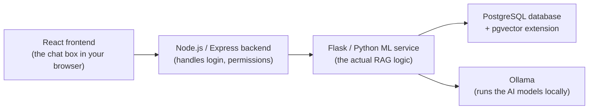

# VetCare Pro — Project Notes

Consolidated from every file previously under `PersonalContext/` and `PersonalContext/insights/`. Each section below is one original document, kept in full with only its heading levels shifted down one level to fit this single-file structure.

## Table of Contents

1. [Setup Instructions](#1-setup-instructions)
2. [AI Assistant — Requirements](#2-ai-assistant--requirements)
3. [AI Assistant — Problem, Solution & Prioritization](#3-ai-assistant--problem-solution--prioritization)
4. [AI Assistant — How It Works](#4-ai-assistant--how-it-works)
5. [AI Assistant — Structured Query Coverage](#5-ai-assistant--structured-query-coverage)
6. [AI Assistant — Sample Questions by Role](#6-ai-assistant--sample-questions-by-role)
7. [Pet Owner Login + AI Assistant](#7-pet-owner-login--ai-assistant)
8. [ML Prediction System — Overview](#8-ml-prediction-system--overview)
9. [ML Prediction System — Technical Reference](#9-ml-prediction-system--technical-reference)
10. [Disease Prediction — API Documentation](#10-disease-prediction--api-documentation)
11. [Disease Analytics — Decision Making](#11-disease-analytics--decision-making)
12. [Sales Forecasting — Decision Making](#12-sales-forecasting--decision-making)
13. [Inventory Demand Forecasting — Decision Making](#13-inventory-demand-forecasting--decision-making)
14. [Role-Based Access Control (whole app)](#14-role-based-access-control-whole-app)
15. [Commercial Deployment Guide](#15-commercial-deployment-guide)

---

## 1. Setup Instructions

*(originally `SETUP.md`)*

### Prerequisites

- Node.js (v18+)
- PostgreSQL (v14+)
- Python 3.10+
- npm

---

### 1. Database Setup

```bash
psql -U postgres -c "CREATE DATABASE vetcarepro;"
psql -U postgres -d vetcarepro -f database/schema.sql
psql -U postgres -d vetcarepro -f database/seed.sql
```

---

### 2. Backend Setup

```bash
cd server
npm install
```

Copy the environment file and configure it:
```bash
cp .env.example .env
```

Key values in `server/.env`:
```env
PORT=3000
NODE_ENV=development
CLIENT_URL=http://localhost:5173

DB_HOST=localhost
DB_PORT=5432
DB_NAME=vetcarepro
DB_USER=vetcarepro_admin
DB_PASSWORD=admin123

JWT_SECRET=your_secret_key_here
JWT_EXPIRE=7d

ML_SERVICE_URL=http://localhost:5001

SMTP_HOST=smtp.gmail.com
SMTP_PORT=587
SMTP_USER=your_email@gmail.com
SMTP_PASS=your_app_password_here
```

Start the backend:
```bash
npm run dev
```

Backend runs on `http://localhost:3000`

---

### 3. Frontend Setup

```bash
cd client
npm install
```

Copy the environment file:
```bash
cp .env .env.local
```

Key values in `client/.env`:
```env
VITE_API_URL=http://localhost:3000/api
VITE_ML_API_URL=http://localhost:3000/api/ml
VITE_APP_NAME=VetCare Pro
```

Start the frontend:
```bash
npm run dev
```

Frontend runs on `http://localhost:5173`

---

### 4. ML Service Setup

```bash
cd ml
python3 -m venv venv
source venv/bin/activate
pip install -r requirements.txt
```

Copy the environment file:
```bash
cp .env.example .env
```

Start the ML service:
```bash
./start.sh
# or
./venv/bin/python app.py
```

> Always use `./start.sh` or `./venv/bin/python` — not `python app.py` directly.

ML service runs on `http://localhost:5001`

---

### 5. Verify All Services

```bash
curl http://localhost:3000/health
curl http://localhost:5001/api/ml/health
```

---

### Access

| Service | URL |
|---------|-----|
| Frontend | http://localhost:5173 |
| Backend API | http://localhost:3000/api |
| ML Service | http://localhost:5001/api/ml |

See `DATABASE.md` for login credentials and database connection details.

---

## 2. AI Assistant — Requirements

*(originally `ai-assistant-requirements.md`)*

### Purpose

Add a modern AI assistant layer to VetCare Pro that helps clinic staff work faster, communicate more clearly, and make better informed decisions while keeping veterinary professionals in control.

### Requirements

- Provide an AI assistant or copilot experience across VetCare Pro with a modern, easy-to-use interface.
- Use retrieval-augmented generation (RAG) so the assistant can answer questions using trusted clinic knowledge sources.
- Support grounded responses from clinic data, pet records, FAQs, care instructions, and other approved reference material.
- Generate concise summaries of key records, including pet medical history, consultation notes, and owner-friendly aftercare instructions.
- Translate existing AI and machine learning outputs into clear natural-language explanations for users.
- Explain outbreak risk predictions, sales forecasts, and inventory demand predictions in a way that is understandable to non-technical users.
- Keep AI outputs focused on decision support rather than automated diagnosis or treatment.
- Make it clear that the assistant does not replace professional veterinary advice, clinical judgment, or human review.
- Prefer safe, traceable answers that can be linked back to trusted source data where possible.
- Design the assistant to reduce manual effort without exposing sensitive data beyond the user's permissions.

### Expected Outcomes

- Faster access to relevant clinic information.
- Better communication with pet owners through clearer summaries and instructions.
- Improved understanding of predictive analytics results.
- Safer use of AI within a veterinary workflow.

---

## 3. AI Assistant — Problem, Solution & Prioritization

*(originally `AI_ASSISTANT_PROBLEM_SOLUTION.md`)*

Scope: AI assistant/copilot layer + mobile app extension for VetCare Pro.

---

### The Problem

- VetCare Pro holds rich clinic data (medical records, ML forecasts, care instructions) but it's only reachable by navigating the web app — there's no conversational way to ask for it
- ML outputs (outbreak risk, sales/inventory forecasts) are technical and hard for non-technical staff or pet owners to interpret
- Pet owners and the public have no mobile access at all today — web only
- Any AI layer touching clinic data must not leak one customer's/role's data to another, and must never present itself as replacing a vet's judgment

---

### Double Diamond

#### 1. Discover *(explore the problem space)*
- Staff and pet owners both struggle to extract quick answers from clinic data (proven in testing — RAG alone hallucinates on count/aggregate questions)
- ML model outputs exist but are shown as raw numbers/charts, not plain language
- Three distinct audiences need three distinct data boundaries: the public, pet owners, and clinic staff
- No mobile presence — everything is web-only today

#### 2. Define *(narrow to one problem statement)*
> VetCare Pro needs an AI layer that makes trusted clinic data and existing ML outputs understandable through natural language — strictly as a decision-support tool, never a replacement for professional veterinary judgment — with data access scoped by role, and reachable from both web and a new mobile app.

#### 3. Develop *(explore solution options)*
| Option | Verdict |
|---|---|
| Pure LLM, no grounding in clinic data | Rejected — would fabricate medical facts |
| RAG grounded in clinic data (records, FAQs, care instructions) | **Selected** for Q&A |
| Free-form text-to-SQL for all data questions | Rejected — correctness/security risk |
| RAG + exact-SQL fallback for count/lookup questions | **Selected** — validated in `structured_query.py` |
| Single unscoped data access for all users | Rejected — privacy risk across guest/owner/staff |
| Three-tier RBAC (guest / pet owner / staff) | **Selected** |
| Web-only | Rejected — doesn't reach pet owners/public |
| Staff access via the mobile app | Rejected — staff workflows remain web-only; mobile serves pet owners and the public |
| Native iOS app (SwiftUI) | **Selected**, phased separately from the AI layer |

#### 4. Deliver *(what this becomes)*
- RAG assistant grounded in pet records, FAQs, and care instructions
- Auto-generated summaries: pet medical history, consultation notes, owner-friendly aftercare instructions
- Plain-language explanations of ML outputs: outbreak risk, sales forecasts, inventory predictions
- Every AI response framed as decision-support, never diagnostic or prescriptive
- Three access modes: guest (general pet care info only), pet owner (own pets only), staff (full clinic data per role)
- Mobile app (iOS) extending the above to pet owners and the public

---

### MoSCoW Prioritization

#### Must Have — *can't ship the AI layer without these*
- RAG assistant grounded in trusted clinic data — *pet records, FAQs, care instructions, not open-web answers*
- Three-tier role-based access scoping — *guest sees general info only; pet owner sees only their own pets; staff sees full clinic data per role*
- Decision-support framing on every AI response — *never phrased as a diagnosis or a replacement for a vet*
- Exact-answer fallback for count/lookup questions — *the RAG hallucination fix already built and validated*

#### Should Have — *high value, ships alongside Must Haves*
- Summaries: pet medical history, consultation notes, owner-friendly aftercare instructions
- Natural-language explanations of ML outputs — *"what does this outbreak risk score mean?"*
- Guest-mode general pet care Q&A — *no clinic-specific or customer data exposed*

#### Could Have — *next phase, once the AI layer is stable*
- Mobile app (iOS) extending VetCare Pro to pet owners and the public
- Push notifications via the mobile app — *appointment reminders, vaccine due dates*
- Typo-tolerant / fuzzy matching, lab report queries, customer growth queries *(earlier structured-query backlog)*
- Voice input, multi-turn conversational memory

> **Resolved:** mobile scope is confirmed as an iOS-only native app (SwiftUI), covering guest and pet-owner modes. Android is out of scope for this program, and staff access stays web-only by design. The mobile build is phased separately so it never blocks the AI layer shipping on web first.

#### Won't Have *(this phase)*
- AI making autonomous clinical decisions or diagnoses — explicitly out of scope, by design
- Free-form text-to-SQL / arbitrary query generation
- Cross-clinic / multi-tenant support
- An Android app — mobile is iOS-only for this program
- Staff access via the mobile app — staff workflows remain web-only
- Full mobile feature parity with web in the first mobile release

---

### Infographics

- `docs/ai_launchpad_double_diamond.svg` — Discover → Define → Develop → Deliver, with activities and outputs per stage
- `docs/ai_launchpad_moscow.svg` — Must / Should / Could / Won't, with an example and rationale per item

---

## 4. AI Assistant — How It Works

*(originally `HOW_THE_AI_ASSISTANT_WORKS.md`)*

This document explains, in simple terms, how VetCare Pro's AI assistant works under the hood. It's written for someone with basic CS/programming knowledge (e.g. a 2nd-year CS student) who hasn't necessarily studied AI or machine learning yet.

---

### 1. The problem: AI models make things up

Large Language Models (LLMs) — the kind of AI that ChatGPT and similar tools use — are very good at writing natural-sounding sentences. But they don't actually "know" your clinic's data. If you just asked a plain LLM:

> "What vaccines has Max had?"

...it has never seen your database. It has two choices: refuse to answer, or **guess** something that sounds plausible. That guessing is called **hallucination** — the model confidently states something false, because it was trained to produce fluent text, not to check facts.

For a vet clinic app, a hallucinated medical answer is dangerous. So we don't let the AI model answer from memory. Instead we use an approach called **RAG**.

---

### 2. RAG in one sentence

**RAG = Retrieval-Augmented Generation.** Before the AI writes an answer, we first *retrieve* (look up) real data related to the question, and then ask the AI to *generate* an answer using **only** that real data — like an open-book exam instead of a memory quiz.

Two steps, in order:
1. **Retrieval** — search the real database for information relevant to the question.
2. **Generation** — hand that information to the AI model and say "using only this, answer the question in plain English."

---

### 3. The big picture (architecture)

VetCare Pro is split into a few pieces that talk to each other:



- **React frontend** — the chat window you type into (e.g. `client/src/pages/AIAssistant.jsx`).
- **Node/Express backend** — checks who you are (logged in as a guest, pet owner, or staff member) and forwards your question to the Python service. It never trusts the frontend to say "I'm an admin" — it checks your login session itself.
- **Flask/Python ML service** — this is where the actual RAG logic lives (`ml/app.py` and everything in `ml/scripts/rag/`).
- **PostgreSQL + pgvector** — the same database the rest of the app uses, with an extra feature (`pgvector`) that lets it store and search lists of numbers efficiently (explained in the next section).
- **Ollama** — a free, open-source tool that runs AI models **on your own computer**, instead of sending your data to an external company's API over the internet. This means no per-question cost and no clinic data leaving the server.

**The two models used (via Ollama):**

| Model | Job | Notes |
|---|---|---|
| `nomic-embed-text` | Turns text into a list of numbers (an "embedding") | Used for search/retrieval |
| `qwen2.5-coder:7b` | Writes the final natural-language answer | Used for generation |

> Note: the chat model has since been changed to `qwen3:8b` — see `ml/.env` / `ml/.env.example` (`OLLAMA_CHAT_MODEL`). The embedding model is unchanged.

---

### 4. What is an "embedding"? (the key idea behind retrieval)

Imagine you could turn every sentence into a single point on a map, where sentences with **similar meaning** end up **close together** on that map, and sentences with different meanings end up far apart.

That "point on a map" is called an **embedding** (also called a **vector**) — it's just a long list of numbers (768 numbers, in our case) that represents the *meaning* of a piece of text.

Example (numbers made up, just to illustrate the idea):
- "What vaccines has Max had?" → `[0.12, -0.45, 0.88, ...]`
- "Max's vaccination history" → `[0.14, -0.42, 0.85, ...]` (very close to the first one — similar meaning!)
- "How much does a checkup cost?" → `[0.91, 0.03, -0.20, ...]` (far away — different meaning)

`pgvector` is a Postgres extension that can store millions of these number-lists and quickly answer: *"which stored pieces of text have embeddings closest to this new embedding?"* This distance-checking is called **cosine similarity** — you don't need the maths, just know it means "how similar are these two points."

So when the clinic's medical records, FAQs, and care instructions were loaded into the system, each piece of text was also converted into an embedding and stored alongside it. This happens in `ml/scripts/rag/ingest.py` and `ml/scripts/rag/chunking.py`, and the stored pieces are called **chunks** (small, bite-sized pieces of text, not entire documents).

---

### 5. Step-by-step: what happens when you ask a question

Let's trace exactly what happens when a receptionist types: *"What vaccines has Max had?"*

1. **You type the question** into the chat box in the browser.
2. **The frontend sends it to Node**, along with nothing about *who* you are — Node already knows that from your login session (a JWT token), so it can't be faked by editing the request.
3. **Node forwards the question to Flask**, now including your role (e.g. `"receptionist"`) and, if you're a pet owner, your customer ID — decided server-side, never trusted from the browser.
4. **Flask first checks: "is this an exact count/list question?"** (`structured_query.py`). Things like *"how many appointments today?"* or *"what vaccines has Max had?"* are answered with a normal, exact SQL query — **no AI model involved at all** for this step. Why? Because in step 5 below, the AI model only ever sees a *small handful* of matching chunks, never the whole database — so if you ask it to *count* something, it would have to guess, and guessing a count is exactly the kind of hallucination we're trying to avoid. Regex (pattern matching on the question text) decides whether a question matches one of these "exact answer" patterns.
5. **If it's not an exact-query question, the actual RAG steps run**:
   - a. Turn your question into an embedding (ask Ollama's `nomic-embed-text` model for the numbers).
   - b. Ask Postgres (via `pgvector`) for the stored chunks whose embeddings are closest to your question's embedding — this is `ml/scripts/rag/retrieval.py`. This search is also **filtered by your role**, so a pet owner's question can never retrieve another customer's data, and a guest's question can never retrieve real clinic records at all — only public FAQs.
   - c. This returns a small number of the most relevant chunks (e.g. the top 5) — not everything in the database, just the best matches.
6. **Flask builds a prompt** — a written instruction for the AI model, roughly:
   > "Here is some real information: [the retrieved chunks]. Using ONLY this information, answer this question: [your question]. Don't make anything up."

   Different **system prompts** (instruction sets) are used depending on your role — pet owners get warm, simple, jargon-free explanations; staff get more clinical language; guests get general pet-care advice when there's no exact clinic FAQ match. This logic lives in `ml/scripts/rag/rag_service.py`.
7. **The prompt is sent to Ollama**, which runs the chat model **on the server itself** — nothing is sent to an outside AI company.
8. **The AI's answer, plus a list of "sources"** (which real records were used) travel back: Ollama → Flask → Node → your browser. That's why the chat window shows little source tags under each answer — so you can verify exactly which record the answer came from, instead of just trusting it blindly.

---

### 6. Keeping data private: the three access modes

The same AI assistant behaves differently depending on who's asking, so private clinic data never leaks to the wrong person:

| Mode | Who | Can see |
|---|---|---|
| **Guest** | Anyone, no login | General pet-care tips and public FAQs only — no real clinic or customer data |
| **Pet owner** | Logged-in customer | Only their **own** pets' records, appointments, and bills |
| **Staff** | Admin / veterinarian / receptionist (logged in) | Full clinic data — but even between staff roles, some things are extra-restricted (e.g. receptionists can look up vaccination history, but can't see medical diagnoses — that's kept for vets/admins only) |

This scoping is enforced on the **server side** every time (in `retrieval.py`'s SQL queries and `structured_query.py`'s role checks) — it's not just "hidden" in the interface, it's genuinely impossible to retrieve through the API.

---

### 7. Beyond answering questions: taking actions (for receptionists)

Recently, the assistant was extended so receptionists can also ask it to **do things**, not just answer questions — like booking an appointment. This is handled carefully so the AI never silently changes real data:

1. **Spotting the request** — simple pattern matching (not the AI model) checks if your message looks like "book an appointment", "cancel", "send a reminder", "register a new customer", etc. (`ml/scripts/rag/action_intent.py`).
2. **Pulling out the details** — the AI model is asked to extract structured details from your sentence (which pet, what date, what time) into a small JSON object — like filling in a form. The AI is only ever used to *read* your sentence and organize it, never to decide what to write to the database.
3. **Asking for anything missing** — if you didn't mention a time, the assistant just asks you, like a normal conversation, until every required detail is filled in.
4. **Always confirming first** — once everything is filled in, the assistant shows a **Confirm / Cancel** button. Nothing is booked, cancelled, or emailed until you explicitly click **Confirm**.
5. **The actual database change** only happens after confirmation, on the Node.js server, using the exact same safety checks the manual "New Appointment" form already uses (e.g. making sure a vet isn't double-booked at the same time).

This keeps a clear line: the AI can **suggest** an action and **read** clinic data, but a human always makes the final call before anything is written.

---

### 8. Why not just let the AI answer everything directly?

Two reasons, both already explained above, worth repeating together:

- **Hallucination** — an AI model answering purely "from memory" (no retrieval) will confidently invent facts it was never given. RAG fixes this by only allowing it to use real, retrieved data.
- **Counting is unreliable with retrieval alone** — even *with* retrieval, the model only ever sees a handful of matching chunks (say, the top 5), never the full table. So for questions like *"how many appointments are there today?"*, letting the AI "count what it sees" would still be a guess. That's why exact SQL is used instead, whenever the question is a count/list rather than an open-ended one.

---

### 9. Key files, if you want to explore the code

| File | What it does |
|---|---|
| `ml/app.py` | The Flask web server — defines the `/api/ml/rag/chat` endpoint the Node backend calls |
| `ml/scripts/rag/rag_service.py` | The main "traffic controller" — decides: action? exact SQL? or full RAG? |
| `ml/scripts/rag/structured_query.py` | Answers exact count/list questions with real SQL, no AI involved |
| `ml/scripts/rag/action_intent.py` | Detects and carries out write-actions (booking, reminders, intake) after confirmation |
| `ml/scripts/rag/retrieval.py` | Does the actual "find similar chunks" search using `pgvector` |
| `ml/scripts/rag/ingest.py` / `chunking.py` | Turns clinic data (FAQs, records) into stored, embedded chunks |
| `ml/scripts/rag/ollama_client.py` | The code that actually talks to Ollama (both models) |
| `server/src/controllers/aiController.js` | Node's entry point — checks who you are, forwards to Flask |
| `server/src/services/aiService.js` | Node's HTTP client that calls the Flask service |
| `client/src/pages/AIAssistant.jsx` | The staff chat page in the browser |

---

### 10. Quick glossary

- **LLM (Large Language Model)** — an AI model trained on huge amounts of text, good at producing natural-sounding language.
- **RAG (Retrieval-Augmented Generation)** — look up real data first, then let the AI write an answer using only that data.
- **Embedding / vector** — a list of numbers representing the *meaning* of a piece of text, so similar meanings end up as nearby numbers.
- **pgvector** — a Postgres extension that stores embeddings and quickly finds the closest ones.
- **Cosine similarity** — the maths used to measure "how close" two embeddings are (you just need to know: bigger similarity = more related meaning).
- **Chunk** — a small piece of text (e.g. one FAQ answer, one medical record) stored with its embedding, ready to be retrieved.
- **Hallucination** — when an AI model confidently states something false because it's guessing rather than using real data.
- **Prompt** — the written instructions given to the AI model before it generates an answer.
- **Ollama** — free, open-source software that runs AI models on your own computer instead of calling an external paid API.

---

## 5. AI Assistant — Structured Query Coverage

*(originally `RAG_QUERY_COVERAGE.md`)*

Questions matching these patterns are answered with an exact SQL lookup instead of semantic RAG retrieval, to avoid hallucinated counts/lists. Anything not listed here falls back to normal RAG.

### Pets
- Count pets by name — *"how many pets are named Max?"*
- Count pets owned by a customer — *"how many pets does John Doe have?"*

### Staff
- Count staff by role — *"how many veterinarians do we have?"*, *"how many receptionists?"*

### Medical Records
- List records for a specific pet — *"list medical records for pet Max"* (*list medical records for pet Max. owner is nishantha rajapaksa*)
- List records for a customer's pets — *"show history for pets of Jane Doe"*

### Vaccinations
- List vaccinations for a pet — *"what vaccines has pet Max had?"*
- Count vaccinations for a pet — *"how many vaccines has Max received?"*

### Inventory
- Low stock items — *"which items are low on stock?"*
- Out of stock items — *"what's out of stock?"*
- Expiring items — *"what's expiring in the next 30 days?"*

### Appointments
- Count by timeframe — *"how many appointments today?"*, *"...this month?"*
- Count no-shows — *"how many no-shows this month?"*
- Count by veterinarian — *"how many appointments does Dr. Silva have?"*
- Count by status — *"how many appointments are cancelled?"*

### Disease Cases
- Contagious case count — *"how many contagious cases are there?"*
- Count by category — *"how many infectious cases?"*
- Count by severity — *"how many critical cases this month?"*

### Billing
- Unpaid bills — *"how many unpaid bills are there?"*
- Revenue by timeframe — *"what's the total revenue this month?"*
- Count by payment method — *"how many bills were paid by cash?"*

---

**Access note:** Inventory, appointments, disease case, and billing queries are staff-only (admin / veterinarian / receptionist). Pet owners asking these fall back to normal RAG rather than seeing clinic-wide operational data.

**Not covered (by design, left to RAG):** FAQs/policies, "explain this diagnosis/forecast" style questions, open-ended clinical questions about a specific case.

---

## 6. AI Assistant — Sample Questions by Role

*(originally `Ai assistant sample questions.md`)*

Reference set for demoing and testing the RAG assistant across all five access
modes. Each mode is grounded to a different data boundary (see
[section 4, "AI Assistant — How It Works"](#4-ai-assistant--how-it-works) /
`ml/scripts/rag/retrieval.py`), so the same question can return very
different answers depending on who's asking.

Test pet owner used throughout: **Nishantha Rajapaksa**, owner of **Max**.

---

### Guest (public, not signed in)

No clinic or customer data — public FAQs plus general veterinary knowledge only.

1. How often should I bring my dog in for a check-up?
2. What vaccines does a new puppy need in the first few months?
3. What are the warning signs that a cat needs to see a vet urgently?
4. Do you have a walk-in clinic, or do I need an appointment?
5. My dog has been scratching a lot lately — what can I give him for it?
   *(expected: the assistant declines to name any medication and redirects to an in-person visit)*

---

### Pet Owner — Nishantha Rajapaksa (Max)

Scoped to Max's own records only — no other customer's pets are visible.

1. What's Max's full medical history?
2. When is Max's next vaccination due?
3. Can you summarize Max's last visit in simple terms?
4. What aftercare should I follow after Max's recent treatment?
5. Does Max have any lab results on file, and what do they mean?
6. Is max up to date on shots?

---

### Receptionist (staff, non-clinical)

Full scheduling/customer/billing access, but blocked from clinical detail
(medical records, disease cases, lab reports) — same boundary enforced in
the regular app.

1. How many appointments are scheduled for tomorrow?
2. Is Nishantha Rajapaksa registered as a customer, and what's on file for him?
3. How many veterinarians do we currently have on staff?
4. Can you check if there's an invoice still pending for Max's last visit?
5. What is Max's diagnosis from his last visit?
   *(expected: declined — clinical detail is outside the receptionist's access)*

---

### Veterinarian (clinical staff)

Full clinical detail plus the clinical-tools layer (full-history summaries,
consultation note drafting, aftercare instructions).

1. Summarize Max's complete medical and vaccination history before his appointment.
2. Draft a consultation note: Max presented with mild lethargy and reduced appetite, temperature slightly elevated, no vomiting.
3. Generate owner-friendly aftercare instructions for Max after today's visit.
4. What should I know about Max before I see him today?
5. Are there any active disease cases in the clinic right now that I should be aware of?

---

### Admin

Same clinical access as veterinarian, plus staff/operations-level questions.

1. How many staff members do we have, broken down by role?
2. Explain this month's sales forecast in plain language.
3. What's the current outbreak risk assessment, and what's driving it?
4. Which inventory items are flagged for reorder, and why?
5. Summarize Max's full history and current inventory reorder recommendations in one overview.

---

### Notes for testing

- Aggregate/count questions (e.g. "how many...") are intentionally included per role — they exercise the structured-SQL fallback rather than semantic retrieval, and should return an exact number, not a guess from a partial sample.
- The guest medication question and the receptionist diagnosis question are deliberate boundary tests — a correct answer is a *decline*, not a fabricated one.
- Swap "Max" / "Nishantha Rajapaksa" for any other seeded pet/owner pair to vary the demo.

---

## 7. Pet Owner Login + AI Assistant

*(originally `README.md`)*

Adds a separate pet-owner portal (email or phone as username, default
password, forced change on first login) with its own AI Assistant window,
scoped to the customer's own pets only. Fully independent from staff auth.

### Setup

1. **Run the migration** against your Postgres DB:
   `database/migrations/add_customer_auth.sql`
   This adds `password_hash`, `password_must_change`, `last_login` to
   `customers`, and backfills every existing customer with the default
   password below.

2. **Default password for all customers:** `VetCare@123`
   Defined once in `server/src/utils/authUtils.js` as `DEFAULT_CUSTOMER_PASSWORD`
   — change it there if you want a different default before running the
   migration or creating new customers.

3. Restart the server so the new routes/middleware load, and rebuild the client.

### How it connects

- `POST /api/customer-auth/login` — `{ identifier, password }`, identifier
  matches `customers.email` OR `customers.phone`.
- New customers created via `createCustomer()` automatically get the default
  password + `password_must_change = true` — no manual step needed for staff.
- `POST /api/ai/customer-chat` — pet-owner-scoped chat, `role: 'pet_owner'`
  and `customerId` are set server-side from the authenticated session, never
  trusted from the client.
- Customer sessions use a separate JWT shape (`type: 'customer'`) and a
  separate localStorage key (`customerToken`), so staff and pet-owner logins
  can never collide, even in the same browser.

### Flow

`Welcome.jsx` → "Sign In — Pet Owner" → `PetOwnerLogin.jsx` →
(if first login) `PetOwnerChangePassword.jsx` → `PetOwnerAIAssistant.jsx`

### Verified before delivery

- Real bcrypt hash/compare and JWT sign/verify round-tripped successfully
  (not just code review) - confirmed a staff token is rejected by the
  customer middleware and vice versa.
- All new/edited files pass a syntax check individually.
- Full `vite build` of the whole client succeeded (805 modules, 0 errors) -
  catches any broken imports across files, not just per-file syntax.
- ESLint clean except one finding also present on the existing
  `AuthContext.jsx` (an accepted pattern in this codebase, not a new issue).

### Not yet tested

No live Postgres instance was available in this environment, so the actual
SQL queries (though modeled directly on your existing, working
`customerModel.js` functions) have not been run against a real database.
Run the migration and try one login end-to-end before relying on this in
production.

### Out of scope (flagging, not building)

- A general "change password" settings page for pet owners (only the forced
  first-login flow exists) - existing pet owners can't set a new password
  outside first login.

- A fuller pet-owner portal (My Pets list, Appointments, Profile) - this
  delivery is scoped to what was asked: login + the AI Assistant window.

---

## 8. ML Prediction System — Overview

*(originally `insights/ML_OVERVIEW.md`)*
### For Clinic Staff & Stakeholders

---

### What is the ML Prediction System?

- The system uses **Machine Learning (ML)** — a type of computer intelligence that learns from past data to make useful predictions
- It has three prediction modules: **Disease Prediction**, **Sales Forecasting**, and **Inventory Demand Forecasting**
- The system learns from real clinic data stored in the database and improves as more data is added

---

### 1. Disease Prediction

#### What does it do?
- Identifies patterns in past disease cases recorded in the clinic
- Predicts which **disease category** a new case is likely to belong to (e.g. respiratory, parasitic, skin)
- Assesses the **disease activity risk level** based on recent case trends
- Forecasts future disease activity over a selected period (1 month to 5 years)
- Groups disease cases into patterns to help staff spot recurring problems

#### What data does it use?

| Data Source | Table | What it captures |
|---|---|---|
| Disease cases | `disease_cases` | Monthly case counts, contagious cases, severity levels, unique diseases — filterable by species and category |
| Appointments | `appointments` | Monthly visit counts and unique pets seen (excluding cancelled) |
| Medical records | `medical_records` | Monthly record counts and follow-up flags |
| Pet demographics | `pets` | Species distribution and average age — active pets only |

#### How does it work — simply?
- The system looks at all past disease records, appointment history, and medical records
- It learns which combinations of species, age, severity, and other factors tend to belong to which disease category
- When a new case comes in, it compares the details to what it has learned and suggests the most likely category
- For disease activity risk, it scores each month using four factors, then assigns a risk level:

| Factor | Weight | What it measures |
|---|---|---|
| Contagious disease rate | 40 points | Proportion of cases that are contagious |
| Species diversity | 20 points | How many different species are affected |
| Severity rate | 20 points | Proportion of severe or critical cases |
| Disease variety | 20 points | Number of distinct diseases relative to case count |

**Risk levels:**

| Score | Level |
|---|---|
| 0 – 34 | Normal |
| 35 – 59 | Moderate |
| 60 – 100 | High |

#### How accurate is it?

| Cases recorded | Accuracy range |
|---|---|
| Fewer than 30 | Unreliable — insufficient data |
| 30 – 99 | Basic predictions, roughly 60–75% accurate |
| 100 – 199 | Fair accuracy, roughly 75–85% |
| 200+ | Reliable predictions, roughly 85–95% |

Accuracy improves automatically as more disease cases are recorded over time.

#### What actions can staff take from this?

| Action | Description |
|---|---|
| View risk level | See the current disease activity risk level on the Analytics dashboard |
| Read the forecast | View projected disease activity for the next 1 month to 5 years |
| Spot patterns | See which disease categories are most common in the clinic |
| Act on recommendations | Get automated guidance (e.g. "Increase preventive measures", "Implement quarantine protocols") |
| Filter by species or category | Narrow the risk view to a specific animal species or disease type |

---

### 2. Sales Trend Forecasting

#### What does it do?
- Predicts **how much revenue** the clinic is likely to generate in the coming days and months
- Shows historical **sales trends** — which months are busier, which days of the week generate more revenue
- Identifies the **top revenue-generating services and products**
- Allows staff to predict revenue for any specific month

#### What data does it use?

| Data Source | Details |
|---|---|
| Daily billing records | Invoice amounts and payment dates |
| Payment methods | Cash, card, and bank transfer breakdowns |
| Service & product breakdown | Consultations, vaccinations, medications, accessories from invoices |
| Appointment types | Appointment categories linked to billing records |

#### How does it work — simply?
- The system looks at all past billing history
- It identifies patterns: which months tend to be high revenue, which days of the week are busiest, whether revenue is growing or declining
- It then projects these patterns into the future to estimate upcoming revenue
- Two approaches are used together: one focuses on the overall trend over time, the other focuses on month-by-month patterns using recent months as a guide

#### How accurate is it?

| Metric | What it means |
|---|---|
| MAE (Mean Absolute Error) | The average gap between predicted and actual revenue — lower is better |
| R² Score | A value between 0 and 1 — closer to 1.0 means more accurate predictions |

Accuracy improves as more billing history is available.

#### What can staff and management use this for?

| Role | Use |
|---|---|
| Management | Set monthly revenue targets and compare Year-over-Year (YoY) growth |
| Admin / Finance | Understand which services bring in the most income |
| Clinic Manager | Plan staffing levels ahead of predicted busy periods |
| All staff | Use the forecast period filter (7 days to 1 year) to view short or long-term projections |

---

### 3. Inventory Demand Forecasting

#### What does it do?
- Predicts **how much of each inventory item** will be needed over the selected forecast period (7 days to 1 year)
- Tells staff **when to reorder** items before they run out
- Identifies **fast-moving items** (used up quickly) and **slow-moving items**
- Groups items by category (medicine, vaccine, accessories, pet food, etc.) and shows demand per category

#### What data does it use?

| Data Source | Details |
|---|---|
| Current stock levels | Quantity on hand for every active inventory item |
| Reorder levels | Minimum stock threshold configured per item |
| Reorder quantity & lead time | Default order quantity and expected delivery time (days) per item |
| Dispensing records | Actual usage from `inventory_transactions` (preferred source) |
| Billing records | Sales-based consumption proxy used when no dispensing records exist — fully paid and partially paid invoices only |
| Item cost & category | Unit cost and category (medicine, vaccine, accessories, pet food, etc.) |

#### How does it work — simply?
- The system tracks how many units of each item are used per day on average
- It estimates how much will be used over the selected forecast period
- It checks if the current stock will last until the next reorder can arrive (assuming a 7-day delivery lead time)
- Items are flagged based on urgency:

| Status | Condition |
|---|---|
| **Urgent** | Stock is at or below reorder level, or will run out before the next delivery arrives |
| **Reorder Soon** | Stock will run out within the forecast period after the delivery lead time |
| **Sufficient** | Stock is adequate for the full forecast period |

- Suggested reorder quantity and estimated cost both scale with the selected forecast period

#### What can staff use this for?

| Use | Description |
|---|---|
| Reorder planning | Know exactly which items need to be ordered and how many, based on the forecast period |
| Cost estimation | See the estimated reorder cost per item and the total reorder spend |
| Avoid stockouts | Prevent running out of critical medicines or supplies |
| Avoid over-ordering | Identify slow-moving items to avoid excess purchasing |
| Flexible planning | Adjust the forecast period (7 days to 1 year) to plan for short-term needs or long-term budgeting |

---

### How the System Learns (General)

1. **Training** — The system processes all available clinic data and builds its prediction models. This is done by the admin from the system interface.
2. **Predicting** — Once trained, the system can instantly answer questions like "What is the disease activity risk?" or "How much stock do we need next month?"
3. **Re-training** — As new data accumulates (new disease cases, new bills, new inventory usage), the model should be retrained to stay accurate. The more data, the better the predictions.

---

### Important Notes for Staff

- Predictions are **guides, not guarantees** — always use professional judgment alongside the system's suggestions
- The system's accuracy improves over time as the clinic records more data
- Disease activity risk levels and reorder alerts should prompt discussion with the veterinarian in charge before taking action
- All predictions are based only on this clinic's own recorded data

---

## 9. ML Prediction System — Technical Reference

*(originally `insights/ML_TECHNICAL_REFERENCE.md`)*
### For Software Engineers, CS Undergraduates & Technical Reviewers

---

### System Architecture

- **Backend**: Node.js / Express API (port 3000)
- **ML Service**: Python / Flask (port 5001, proxied through Node.js)
- **Database**: PostgreSQL
- **ML Libraries**: scikit-learn, Prophet (Meta), pandas, NumPy, joblib
- **Model Persistence**: Pickle / joblib serialisation saved to `ml/models/`
- **Base Class**: `ml/utils/model_base.py` — `BaseMLModel` abstract class with `train()`, `predict()`, `save_model()`, `load_model()`

---

### Module 1 — Disease Prediction (`ml/scripts/disease_prediction.py`)

#### Class: `DiseasePredictionModel(BaseMLModel)`

#### Data Source
- Table: `disease_cases` (loaded via `utils/data_loader.py` → `DataLoader.load_disease_data()`)
- Key columns used as features:

| Column | Type | Role |
|---|---|---|
| `species` | categorical | Feature |
| `breed` | categorical | Feature |
| `disease_category` | categorical | Feature & Target |
| `severity` | categorical | Feature |
| `age_at_diagnosis` | numeric (months) | Feature |
| `treatment_duration_days` | numeric | Feature |
| `is_contagious` | boolean | Feature |
| `diagnosis_date` | date | Temporal analysis |
| `disease_name` | string | Pattern/trend analysis |
| `region` | string | Geographic analysis |

#### Feature Engineering
- Categorical columns (`species`, `breed`, `disease_category`, `severity`) → `LabelEncoder` (integer encoding)
- Numerical columns used as-is after `StandardScaler` normalisation
- Binary column `is_contagious` → cast to `int` (0/1)
- All features horizontally stacked into a NumPy matrix via `np.hstack()`

#### Algorithms

**1. Gaussian Naive Bayes (Classification)**
- Library: `sklearn.naive_bayes.GaussianNB`
- Task: Multi-class disease category classification
- Trigger condition: `≥ 3 unique disease categories` AND `≥ 30 total records`
- Train/test split: **80% / 20%** using `train_test_split(stratify=y, random_state=42)`
- Stratification: preserves class distribution in both splits
- Chosen because: performs well on small datasets, computationally cheap, handles multi-class natively

**2. K-Means Clustering (Pattern Discovery)**
- Library: `sklearn.cluster.KMeans`
- Task: Unsupervised grouping of disease cases into patterns
- Trigger condition: `≥ 20 records`
- Number of clusters: `n_clusters = min(3, min(5, max(2, data_size // 10)))`
- Evaluation: **Silhouette Score** (range −1 to +1; higher = better-defined clusters)
- `n_init=10`, `random_state=42` for reproducibility
- No train/test split — uses full dataset

**3. Rule-Based Disease Activity Risk Scoring**
- Not a learned model — deterministic scoring function
- Inputs: recent `disease_cases` filtered by `days_lookback` (default: 30 days)
- Risk score accumulation:

| Factor | Condition | Score Added |
|---|---|---|
| Case count | ≥ 10 cases | +3 |
| Case count | 5–9 cases | +2 |
| Case count | 3–4 cases | +1 |
| Contagious cases | each contagious case | +1.5 |
| Severity | ≥ 3 severe/critical cases | +2 |
| Severity | 1–2 severe/critical | +1 |
| Repeated disease | same disease ≥ 3 times | +2 |
| Increasing trend | second half > 1.5× first half | +2 |

- Risk level thresholds: `score < 4` → Low, `4–6` → Medium, `7–9` → High, `≥ 10` → Critical
- Monthly forecast uses `activity_score` and `activity_level` (separate from the risk score above)

#### Accuracy Metrics
- Classification: **Accuracy Score** (`sklearn.metrics.accuracy_score`) on 20% test set
- Confidence tiers based on training data size:

| Data Size | Confidence | Expected Accuracy |
|---|---|---|
| < 30 | very_low | Unreliable |
| 30–99 | low | 60–75% |
| 100–199 | medium | 75–85% |
| ≥ 200 | high | 85–95% |

- Clustering quality: **Silhouette Score** (computed on full dataset post-fit)

#### Model Persistence
- Packaged as a dict: `classification_model`, `clustering_model`, `label_encoders`, `scaler`, metadata
- Saved via `BaseMLModel.save_model()` using pickle to `ml/models/disease_prediction.pkl`

---

### Module 2 — Sales Forecasting (`ml/scripts/sales_forecasting.py`)

#### Class: `SalesForecastingModel(BaseMLModel)`

#### Data Sources
- Table: `billing` — daily revenue aggregation (only `fully_paid` + `partially_paid` records)
- Table: `billing_items` — per item-type revenue breakdown
- Table: `appointments` — appointment-type revenue linkage
- Table: `daily_sales_summary` — populated by the model during training (upserted)

#### Feature Engineering

**Time-Series Preparation (for Prophet)**
- Aggregated to daily level: `DATE(bill_date)` → `ds`, `SUM(total_amount)` → `y`
- Missing dates in the range filled with `y = 0` via `reindex(date_range, fill_value=0)`
- Prophet requires `ds` (datetime) and `y` (float) columns

**Monthly Feature Engineering (for Random Forest)**
- Daily billing aggregated to monthly level by `(year, month)`
- Lag features: `revenue_lag1`, `revenue_lag2`, `revenue_lag3` (previous 1/2/3 months)
- Rolling feature: `revenue_rolling3` (3-month rolling mean, shifted by 1)
- Cyclical encoding: `sin_month = sin(2π × month / 12)`, `cos_month = cos(2π × month / 12)`
- Seasonal flag: `is_holiday_season` = 1 for months 12 and 1
- Quarter: `quarter = ((month - 1) // 3) + 1`
- Rows with NaN (caused by lag features at start of series) dropped via `dropna()`

#### Algorithms

**1. Prophet (Time-Series Forecasting)**
- Library: `prophet` (Meta / Facebook)
- Task: Daily/monthly revenue forecasting
- Minimum data: 14 days of history
- Configuration:
  - `yearly_seasonality=True`
  - `weekly_seasonality=True`
  - `daily_seasonality=False`
  - `seasonality_mode='multiplicative'` (scales seasonality with trend level)
  - `changepoint_prior_scale=0.05` (conservative trend flexibility)
  - `seasonality_prior_scale=10.0`
  - Custom monthly seasonality added: `period=30.5, fourier_order=5`
- Train/test split: last 30 days of training data used as pseudo-test set for evaluation
- Output: `yhat` (predicted), `yhat_lower`, `yhat_upper` (uncertainty intervals), `trend`, `weekly`, `yearly` components

**2. Random Forest Regressor (Monthly Demand Prediction)**
- Library: `sklearn.ensemble.RandomForestRegressor`
- Task: Predict monthly revenue from feature matrix
- Parameters: `n_estimators=100`, `max_depth=6`, `min_samples_leaf=2`, `random_state=42`
- Train/test split: **80% / 20%** if `≥ 6 months` of data; otherwise trains on full set
- Features scaled via `StandardScaler` before fitting

**3. Linear Trend (Fallback)**
- Used when Prophet is unavailable or data is insufficient
- Fits `LinearRegression` on last 6 months of monthly revenue
- Projects trend slope × future month index as forecast

#### Accuracy Metrics
- **Prophet**: MAE (Mean Absolute Error) on the last 30-day pseudo-test window
- **Random Forest**: MAE + R² Score (`r2_score`) on the held-out 20% test split
- Feature importances stored per feature column
- R² close to 1.0 = model explains most revenue variance; close to 0 = near-random predictions

#### Prediction API
- `forecast_revenue(periods=90)` → returns daily + aggregated monthly forecast
- `predict_monthly_revenue(month, year)` → single-month prediction using Random Forest
- `get_sales_trends(months=12)` → historical monthly, day-of-week, YoY, service breakdown
- `get_top_revenue_services(limit=10)` → SQL-ranked top services by total revenue

---

### Module 3 — Inventory Demand Forecasting (`ml/scripts/inventory_forecasting.py`)

#### Class: `InventoryForecastingModel(BaseMLModel)`

#### Data Sources
- Table: `inventory` — current stock snapshot (`is_active = true` only)
- Table: `billing_items` JOIN `billing` — consumption history proxy (items billed = items used)
- Only `fully_paid` + `partially_paid` billing records included

#### Feature Engineering

**Per-Item Demand Statistics**
- For each inventory item, daily usage extracted from `billing_items` grouped by `DATE(bill_date)`
- Missing dates between first and last usage filled with 0 via `reindex(date_range, fill_value=0)`
- Computed per item:
  - `avg_daily_demand` = mean of daily usage series
  - `std_daily_demand` = standard deviation of daily usage
  - `total_consumed` = sum of all billed quantities
  - `days_observed` = length of the date range observed
  - `demand_trend` = slope coefficient from `LinearRegression` fit on weekly-aggregated usage (requires ≥ 14 days, ≥ 3 weeks)

**Training Feature Matrix**
- Only items with `avg_daily_demand > 0` OR `total_consumed > 0` are included
- Features per item:

| Feature | Description |
|---|---|
| `category_encoded` | Integer-encoded inventory category |
| `current_stock` | Current quantity on hand |
| `reorder_level` | Minimum stock threshold |
| `reorder_quantity` | Standard reorder batch size |
| `unit_cost` | Cost per unit |
| `avg_daily_demand` | Historical average daily usage |
| `std_daily_demand` | Variability in daily usage |
| `demand_trend` | Weekly trend slope |
| `days_observed` | Days of consumption history |

- Target variable: `demand_30d = avg_daily_demand × 30 × (1 + demand_trend.clip(−0.5, 0.5))`

#### Algorithm

**Gradient Boosting Regressor**
- Library: `sklearn.ensemble.GradientBoostingRegressor`
- Task: Predict 30-day demand per inventory item
- Parameters: `n_estimators=100`, `max_depth=4`, `learning_rate=0.1`, `min_samples_leaf=2`, `random_state=42`
- Train/test split: **80% / 20%** if `≥ 6 items` with history; otherwise trains on full set
- Features scaled via `StandardScaler`

#### Reorder Logic (Rule-Based, Post-Prediction)

**Safety Stock Calculation**
- Formula: `safety_stock = 1.65 × std_daily_demand × √(lead_time_days)`
- Z = 1.65 corresponds to **95% service level** (probability of not stocking out during lead time)
- Default `lead_time_days = 7` (configurable)

**Optimal Reorder Point**
- `optimal_reorder_point = max(reorder_level, ceil(avg_daily_demand × lead_time + safety_stock))`

**Urgency Classification**
| Condition | Category |
|---|---|
| `current_stock ≤ reorder_level` OR `days_until_stockout ≤ lead_time` | Urgent |
| `days_until_stockout ≤ lead_time + 7` | Reorder Soon |
| Otherwise | Sufficient |

**Days Until Stockout**
- `days_until_stockout = current_stock / avg_daily_demand` (integer division, capped at 999 if demand = 0)

#### Accuracy Metrics
- **Demand model**: MAE + R² Score on held-out test split
- **Confidence per item**:
  - `days_observed > 30` → High
  - `days_observed > 7` → Medium
  - `≤ 7` → Low

#### Prediction API
- `predict_item_demand(item_id, days=30)` → demand, safety stock, reorder recommendation
- `get_reorder_recommendations()` → all items classified into Urgent / Soon / Sufficient
- `get_fast_moving_items(limit=10)` → top items by avg daily demand
- `predict_restock_date(item_id)` → estimated stockout and restock dates
- `get_category_demand_analysis()` → demand aggregated by category

---

### Cross-Cutting Technical Details

#### Train / Test Split Summary

| Model | Algorithm | Split Ratio | Split Condition |
|---|---|---|---|
| Disease Classification | Gaussian Naive Bayes | 80/20, stratified | ≥ 30 records, ≥ 3 classes |
| Disease Clustering | K-Means | No split (unsupervised) | ≥ 20 records |
| Sales Time-Series | Prophet | Last 30 days as test | ≥ 14 days history |
| Sales Monthly | Random Forest | 80/20 | ≥ 6 months; else full set |
| Inventory Demand | Gradient Boosting | 80/20 | ≥ 6 items; else full set |

#### Metrics Summary

| Model | Primary Metric | Secondary Metric |
|---|---|---|
| Disease Classification | Accuracy Score | Classification Report (precision, recall, F1) |
| Disease Clustering | Silhouette Score | Cluster size distribution |
| Sales (Prophet) | MAE (30-day window) | — |
| Sales (Random Forest) | MAE | R² Score, Feature Importances |
| Inventory (Gradient Boosting) | MAE | R² Score |

#### Model Versioning & Persistence
- All models serialised via `pickle` to `ml/models/<model_name>.pkl`
- Loaded on demand; re-trained via admin API endpoints
- No automated retraining schedule — manual trigger required

#### Flask API Endpoints (ML Service)
- `POST /ml/disease/train` — trigger disease model training
- `GET /ml/disease/predict` — classification prediction
- `POST /ml/disease/outbreak-risk` — rule-based disease activity risk score
- `GET /ml/disease/patterns` — cluster analysis
- `POST /ml/sales/train` — trigger sales model training
- `GET /ml/sales/forecast` — Prophet revenue forecast
- `GET /ml/sales/trends` — historical trend analysis
- `GET /ml/sales/top-services` — top revenue services
- `GET /ml/sales/predict-month` — Random Forest single-month prediction
- `POST /ml/inventory/train` — trigger inventory model training
- `GET /ml/inventory/reorder` — reorder recommendations
- `GET /ml/inventory/fast-moving` — fast/slow moving items
- `GET /ml/inventory/category-analysis` — category demand
- `GET /ml/inventory/item/<id>` — per-item demand prediction

#### Known Limitations
- Inventory consumption is inferred from `billing_items` (sales proxy) — direct usage tracking (e.g. dispensing records separate from billing) is not implemented
- Disease model accuracy is currently in the low confidence tier (54 cases)
- Prophet requires a minimum of 14 days of data; falls back to linear trend if not met
- Lead time is a fixed default of 7 days — no supplier-specific lead time data integrated
- No automated model drift detection or retraining triggers
- `random_state=42` used throughout for reproducibility

---

## 10. Disease Prediction — API Documentation

*(originally `insights/DISEASE_PREDICTION_API.md`)*

**Phase 2: Disease Prediction ML**
**Last Updated**: March 26, 2026

### Overview

The Disease Prediction ML System provides:
- **Disease Classification**: Predict disease categories using Naive Bayes
- **Pattern Recognition**: Identify disease clusters using K-Means
- **Disease Activity Risk Assessment**: Real-time risk scoring based on recent cases
- **Trend Analysis**: Species-specific disease trends
- **Geographic Analysis**: Disease distribution by region

#### System Architecture
```
Frontend (React) → Backend API (Node.js:3000) → ML Service (Flask:5001) → PostgreSQL
                                                       ↓
                                              ML Models (scikit-learn)
```

---

### ML Model Details

#### Current Model Status
- **Data Size**: 54 disease cases
- **Training Date**: February 17, 2026
- **Models Trained**: Classification (Naive Bayes), Clustering (K-Means)
- **Confidence Level**: Low (60-75% accuracy range)
- **Species Coverage**: Dogs, Cats, Rabbits

#### Model Performance
```json
{
  "classification_accuracy": 1.0,
  "clustering_silhouette_score": 0.241,
  "clusters_identified": 3,
  "recommendation": "Continue collecting data for better accuracy"
}
```

#### Disease Categories
`infectious` · `parasitic` · `metabolic` · `genetic` · `immune_mediated` · `neoplastic` · `traumatic` · `nutritional`

---

### ML Service API (Flask - Port 5001)

Base URL: `http://localhost:5001/api/ml`

#### 1. Health Check
```http
GET /api/ml/health
```

**Response:**
```json
{
  "status": "healthy",
  "service": "VetCare Pro ML Service",
  "version": "1.0.0"
}
```

---

#### 2. Model Status
```http
GET /api/ml/models/status
```

**Response:**
```json
{
  "success": true,
  "models": {
    "disease_prediction": {
      "loaded": true,
      "trained": true,
      "data_size": 54,
      "training_date": "2026-02-17T09:32:56.196673",
      "confidence": {
        "level": "low",
        "description": "Limited data - basic predictions only",
        "accuracy_range": "60-75%",
        "recommendation": "Continue collecting data for better accuracy"
      }
    }
  }
}
```

---

#### 3. Disease Category Prediction
```http
POST /api/ml/disease/predict
Content-Type: application/json
```

**Request Body:**
```json
{
  "species": "Dog",
  "breed": "Labrador",
  "age_at_diagnosis": 36,
  "severity": "moderate",
  "is_contagious": false
}
```

**Response:**
```json
{
  "status": "success",
  "predictions": [
    {
      "predicted_category": "metabolic",
      "confidence": 0.85,
      "confidence_level": "high",
      "all_probabilities": {
        "metabolic": 0.85,
        "genetic": 0.08,
        "infectious": 0.04,
        "immune_mediated": 0.02,
        "parasitic": 0.01
      }
    }
  ],
  "model_confidence": {
    "level": "low",
    "accuracy_range": "60-75%"
  }
}
```

---

#### 4. Disease Activity Risk Assessment
```http
POST /api/ml/disease/outbreak-risk
Content-Type: application/json
```

**Request Body:**
```json
{
  "species": "Dog",
  "disease_category": "infectious",
  "region": "Colombo",
  "days_lookback": 60
}
```

**Response:**
```json
{
  "success": true,
  "risk_assessment": {
    "risk_level": "medium",
    "risk_score": 5,
    "case_count": 3,
    "contagious_cases": 2,
    "days_analyzed": 60,
    "reasons": [
      "3 cases in 60 days",
      "2 contagious cases"
    ],
    "confidence": "low",
    "filters": {
      "species": "Dog",
      "disease_category": "infectious",
      "region": "Colombo"
    },
    "recommendation": "MODERATE CONCERN: Monitor situation, review vaccination schedules, maintain hygiene protocols."
  }
}
```

**Risk Levels:**
- `low` (0-3): Normal status, continue routine care
- `medium` (4-6): Moderate concern, increase monitoring
- `high` (7-9): High alert, increase preventive measures
- `critical` (10+): Immediate action required, implement quarantine

---

#### 5. Disease Pattern Analysis
```http
GET /api/ml/disease/patterns
```

**Response:**
```json
{
  "success": true,
  "patterns": {
    "status": "success",
    "patterns_found": 3,
    "patterns": [
      {
        "pattern_id": 0,
        "case_count": 33,
        "primary_species": "Dog",
        "common_category": "metabolic",
        "avg_age": 37.5,
        "contagious_percentage": 3.03,
        "common_diseases": {
          "Acute kidney disease": 1,
          "Chronic Kidney Disease": 1
        },
        "affected_species": {
          "Dog": 26,
          "Cat": 6,
          "Rabbit": 1
        }
      }
    ],
    "confidence": {
      "level": "low",
      "accuracy_range": "60-75%"
    }
  }
}
```

---

#### 6. Species Trends
```http
GET /api/ml/disease/trends?species=Dog
```

**Response:**
```json
{
  "success": true,
  "trends": {
    "species": "Dog",
    "total_cases": 33,
    "disease_distribution": {
      "metabolic": 22,
      "genetic": 5,
      "immune_mediated": 3,
      "infectious": 1,
      "parasitic": 2
    },
    "most_common_diseases": {
      "Hip Dysplasia": 2,
      "Chronic Kidney Disease": 1
    },
    "contagious_percentage": 3.03,
    "avg_age_at_diagnosis": 35.18,
    "severity_distribution": {
      "mild": 1,
      "moderate": 30,
      "severe": 2
    },
    "monthly_trends": {
      "2024-04": 1,
      "2024-05": 2,
      "2024-08": 5,
      "2024-09": 9,
      "2024-10": 5,
      "2024-11": 7
    }
  }
}
```

---

#### 7. Geographic Distribution
```http
GET /api/ml/disease/geographic
```

**Response:**
```json
{
  "success": true,
  "distribution": {
    "status": "success",
    "regions": {
      "Colombo": {
        "total_cases": 20,
        "categories": {
          "metabolic": 15,
          "infectious": 3,
          "genetic": 2
        },
        "contagious_cases": 2,
        "species": {
          "Dog": 12,
          "Cat": 8
        }
      }
    },
    "total_regions": 5,
    "hotspot": "Colombo"
  }
}
```

---

#### 8. Train/Retrain Model
```http
POST /api/ml/disease/train
```

**Response:**
```json
{
  "success": true,
  "message": "Model trained successfully",
  "results": {
    "data_size": 54,
    "models_trained": ["classification", "clustering"],
    "classification_accuracy": 1.0,
    "clusters": 3,
    "silhouette_score": 0.241,
    "training_date": "2026-02-17T09:32:56.196673",
    "model_path": "./models/disease_prediction_20260217.pkl"
  }
}
```

---

### Backend Disease API (Node.js - Port 3000)

Base URL: `http://localhost:3000/api/disease-cases`

**Authentication Required**: All endpoints require JWT token in Authorization header
```
Authorization: Bearer <token>
```

#### 1. Get All Disease Cases
```http
GET /api/disease-cases?limit=10&offset=0
```

**Query Parameters:**
- `pet_id` - Filter by pet
- `species` - Filter by species (Dog, Cat, Rabbit)
- `disease_category` - Filter by category
- `severity` - Filter by severity (mild, moderate, severe, critical)
- `is_contagious` - Filter contagious diseases (true/false)
- `outcome` - Filter by outcome (recovered, ongoing, deceased)
- `region` - Filter by region
- `diagnosis_date_from` - Start date (YYYY-MM-DD)
- `diagnosis_date_to` - End date (YYYY-MM-DD)
- `search` - Search in disease name, symptoms, notes
- `limit` - Results per page
- `offset` - Pagination offset

**Response:**
```json
{
  "status": "success",
  "results": 10,
  "total": 54,
  "data": {
    "cases": [
      {
        "case_id": 54,
        "pet_id": "PET001",
        "pet_name": "Max",
        "species": "Dog",
        "breed": "Labrador",
        "disease_name": "Chronic Kidney Disease",
        "disease_category": "metabolic",
        "diagnosis_date": "2024-11-15",
        "age_at_diagnosis": 84,
        "severity": "moderate",
        "outcome": "recovered",
        "is_contagious": false,
        "owner_first_name": "John",
        "owner_last_name": "Doe"
      }
    ]
  }
}
```

---

#### 2. Get Disease Case by ID
```http
GET /api/disease-cases/:id
```

**Response:**
```json
{
  "status": "success",
  "data": {
    "case": {
      "case_id": 54,
      "pet_id": "PET001",
      "pet_name": "Max",
      "species": "Dog",
      "breed": "Labrador",
      "disease_name": "Chronic Kidney Disease",
      "disease_category": "metabolic",
      "diagnosis_date": "2024-11-15",
      "age_at_diagnosis": 84,
      "severity": "moderate",
      "outcome": "recovered",
      "treatment_duration_days": 30,
      "symptoms": "Increased thirst, weight loss, lethargy",
      "region": "Colombo",
      "is_contagious": false,
      "notes": "Regular monitoring required",
      "owner_first_name": "John",
      "owner_last_name": "Doe",
      "owner_phone": "+94771234567",
      "owner_email": "john.doe@example.com"
    }
  }
}
```

---

#### 3. Create Disease Case
```http
POST /api/disease-cases
Content-Type: application/json
```

**Required Role**: Veterinarian or Admin

**Request Body:**
```json
{
  "pet_id": "PET001",
  "appointment_id": "APPT-2025-0001",
  "disease_name": "Chronic Kidney Disease",
  "disease_category": "metabolic",
  "diagnosis_method": "blood_test",
  "diagnosis_date": "2024-11-15",
  "species": "Dog",
  "breed": "Labrador",
  "age_at_diagnosis": 84,
  "severity": "moderate",
  "outcome": "ongoing",
  "treatment_duration_days": 30,
  "symptoms": "Increased thirst, weight loss",
  "region": "Colombo",
  "is_contagious": false,
  "transmission_method": null,
  "notes": "Regular monitoring required"
}
```

**Response:**
```json
{
  "status": "success",
  "message": "Disease case created successfully",
  "data": {
    "case": { /* created case object */ }
  }
}
```

---

#### 4. Update Disease Case
```http
PUT /api/disease-cases/:id
Content-Type: application/json
```

**Required Role**: Veterinarian or Admin

**Request Body:** (same as create, all fields optional)

**Response:**
```json
{
  "status": "success",
  "message": "Disease case updated successfully",
  "data": {
    "case": { /* updated case object */ }
  }
}
```

---

#### 5. Delete Disease Case
```http
DELETE /api/disease-cases/:id
```

**Required Role**: Admin only

**Response:**
```json
{
  "status": "success",
  "message": "Disease case deleted successfully"
}
```

---

#### 6. Get Disease Cases by Pet
```http
GET /api/disease-cases/pet/:petId
```

**Response:**
```json
{
  "status": "success",
  "results": 3,
  "data": {
    "cases": [ /* array of disease cases for this pet */ ]
  }
}
```

---

#### 7. Disease Statistics Overview
```http
GET /api/disease-cases/statistics/overview
```

**Response:**
```json
{
  "status": "success",
  "data": {
    "statistics": {
      "total_cases": "54",
      "affected_pets": "37",
      "species_count": "3",
      "category_count": "5",
      "contagious_cases": "3",
      "critical_cases": "1",
      "recovered_cases": "43",
      "avg_age_at_diagnosis": "33.20",
      "avg_treatment_duration": "30.33"
    }
  }
}
```

---

#### 8. Cases by Category
```http
GET /api/disease-cases/statistics/by-category
```

**Response:**
```json
{
  "status": "success",
  "data": {
    "categories": [
      {
        "disease_category": "metabolic",
        "case_count": "37",
        "contagious_count": "0",
        "avg_age": "38.14",
        "affected_species": "Cat, Dog, Rabbit"
      }
    ]
  }
}
```

---

#### 9. Recent Disease Cases
```http
GET /api/disease-cases/recent?days=30&limit=10
```

**Response:**
```json
{
  "status": "success",
  "results": 5,
  "data": {
    "cases": [ /* recent cases */ ]
  }
}
```

---

### Usage Examples

#### Example 1: Monitor Disease Activity Risk for Dogs
```bash
# Step 1: Get auth token
TOKEN=$(curl -s -X POST http://localhost:3000/api/auth/login \
  -H "Content-Type: application/json" \
  -d '{"email":"vet@example.com","password":"password"}' \
  | python3 -c "import sys, json; print(json.load(sys.stdin)['data']['token'])")

# Step 2: Check outbreak risk
curl -X POST http://localhost:5001/api/ml/disease/outbreak-risk \
  -H "Content-Type: application/json" \
  -d '{
    "species": "Dog",
    "days_lookback": 60
  }' | python3 -m json.tool
```

#### Example 2: Get Disease Trends & Statistics
```bash
# Get species trends from ML service
curl http://localhost:5001/api/ml/disease/trends?species=Dog

# Get statistics from backend
curl -H "Authorization: Bearer $TOKEN" \
  http://localhost:3000/api/disease-cases/statistics/overview
```

#### Example 3: Create New Disease Case
```bash
curl -X POST http://localhost:3000/api/disease-cases \
  -H "Authorization: Bearer $TOKEN" \
  -H "Content-Type: application/json" \
  -d '{
    "pet_id": "PET001",
    "disease_name": "Canine Parvovirus",
    "disease_category": "infectious",
    "diagnosis_date": "2026-02-17",
    "species": "Dog",
    "breed": "German Shepherd",
    "age_at_diagnosis": 6,
    "severity": "severe",
    "outcome": "ongoing",
    "symptoms": "Vomiting, diarrhea, lethargy",
    "is_contagious": true,
    "transmission_method": "fecal_oral"
  }'
```

#### Example 4: Retrain ML Model
```bash
# Trigger model retraining (after adding new cases)
curl -X POST http://localhost:5001/api/ml/disease/train
```

---

### Data Requirements

#### Minimum Data for Model Training
- **Very Low Confidence**: < 30 cases (unreliable predictions)
- **Low Confidence**: 30-100 cases (basic predictions, 60-75% accuracy)
- **Medium Confidence**: 100-200 cases (fair predictions, 75-85% accuracy)
- **High Confidence**: 200+ cases (reliable predictions, 85-95% accuracy)

#### Current Status: 54 Cases (Low Confidence)
**Recommendation**: Continue collecting disease case data to improve model accuracy.

#### Data Quality Requirements
1. **Diverse Disease Categories**: At least 10 cases per category
2. **Species Coverage**: Multiple breeds within each species
3. **Temporal Coverage**: Cases spread across different time periods
4. **Geographic Diversity**: Cases from different regions
5. **Complete Records**: All required fields populated

---

### Model Maintenance

#### Retraining Schedule
- **Manual**: On-demand via `/api/ml/disease/train` endpoint (admin only)
- **Recommended**: Retrain monthly during early adoption, or after every 50+ new cases

#### Performance Monitoring
Monitor these metrics to assess model quality:
1. Classification accuracy (aim for > 85%)
2. Silhouette score (aim for > 0.5)
3. Prediction confidence levels
4. False positive/negative rates for outbreak predictions

---

### Error Handling

#### Common HTTP Status Codes
- `200` - Success
- `201` - Resource created
- `400` - Bad request (missing required fields)
- `401` - Unauthorized (invalid/missing token)
- `403` - Forbidden (insufficient permissions)
- `404` - Resource not found
- `500` - Internal server error
- `503` - Service unavailable (model not trained)

#### Example Error Response
```json
{
  "status": "error",
  "message": "Disease prediction model not trained yet"
}
```

---

### Testing Checklist

- [x] ML Service Health Check
- [x] Model Status Endpoint
- [x] Disease Prediction
- [x] Outbreak Risk Assessment
- [x] Pattern Analysis
- [x] Species Trends
- [x] Geographic Distribution
- [x] Model Training/Retraining
- [x] Backend CRUD Operations
- [x] Disease Statistics
- [x] Authentication & Authorization
- [x] Data Validation
- [x] Error Handling

---

### Support & Troubleshooting

#### ML Service Not Starting
```bash
# Check if port 5001 is in use
lsof -i :5001
kill -9 <PID>

# Start ML service (always use venv)
cd ml && ./start.sh
# or
cd ml && ./venv/bin/python app.py
```

#### Model Not Loaded
```bash
# Train via the API (admin token required)
curl -X POST http://localhost:5001/api/ml/disease/train \
  -H "Authorization: Bearer $TOKEN"
```

#### Backend API Errors
```bash
# Check server logs
cd server
npm run dev
```

---

**Last Updated**: March 26, 2026

---

## 11. Disease Analytics — Decision Making

*(originally `insights/disease-analytics.md`)*

### What Is Disease Analytics?

Disease analytics looks at the history of illness cases treated at the clinic and uses that data to spot patterns, predict risks, and help staff take the right actions at the right time.

---

### Insights You Can Get

- **Most common diseases** — See which illnesses appear most frequently across all patients. Helps the clinic stay prepared with the right medicines and equipment.

- **Disease trends over time** — Understand whether a particular disease is increasing or decreasing month by month. Useful for spotting seasonal outbreaks early.

- **Affected species and breeds** — Find out which animal types are most at risk for specific conditions. Helps vets tailor their examination approach.

- **Age-related patterns** — Identify whether certain diseases mostly affect young, adult, or senior animals. Supports age-based preventive care advice to owners.

- **Contagious disease tracking** — Quickly see all cases flagged as contagious. Helps the clinic take isolation and hygiene measures before an outbreak spreads.

- **Treatment outcome patterns** — Review which treatments were used for similar cases and how patients responded. Helps vets choose the most effective treatment plan.

---

### Prediction and Forecasting Details

- **Disease risk prediction** — Based on an animal's species, breed, age, symptoms, and past records, the system predicts the likelihood of specific diseases. This gives vets a starting point before running tests.

- **Cluster-based grouping** — Animals with similar health profiles are automatically grouped together. If one animal in a group develops a disease, the vet knows to monitor others in the same group more closely.

- **Early warning signals** — The system can flag when the number of cases for a particular disease is rising faster than normal, prompting the team to prepare ahead of time.

- **High-risk patient identification** — Patients who match profiles associated with past serious conditions are flagged so vets can prioritise follow-ups and preventive care.

---

### How This Helps Decision Making

- **Vets** can make faster, more confident diagnoses by seeing what conditions are most likely based on the animal's profile and current symptoms.

- **Clinic managers** can plan staffing and stock levels around disease peaks and seasonal patterns.

- **Receptionists** can advise owners on common health risks for their pet's species or breed when booking appointments.

- **The whole team** benefits from having a clear picture of what is happening across all patients — not just case by case, but as a whole.

---

### Outbreak Risk — Time Period Reference

When assessing outbreak risk, the time period selected determines how far back the system looks at disease cases. Different periods serve different purposes in real-world veterinary surveillance.

| Time Period | Primary Use |
|---|---|
| Last 30 days | Detect acute outbreaks and fast-spreading contagious diseases |
| Last 60 days | Short-term contagious disease monitoring |
| Last 90 days | Quarterly surveillance review |
| Last 6 months | Seasonal pattern detection |
| Last 1 year | Full seasonal cycle analysis, year-over-year baseline comparison |
| Last 2 years | Multi-year endemic disease trends, vaccination programme effectiveness |
| Last 5 years | Long-term rare disease surveillance, breed-specific susceptibility patterns |

Longer periods give the prediction model more data to work with, which improves accuracy — especially for diseases that occur infrequently or follow multi-year cycles. A minimum of one year of data is recommended for reliable outbreak risk assessments.

---

### In Simple Terms

Instead of relying only on memory or individual experience, the clinic can use data from every case ever recorded to make smarter, faster, and more consistent decisions about animal health.

---

## 12. Sales Forecasting — Decision Making

*(originally `insights/sales-forecasting.md`)*

### What Is Sales Forecasting?

Sales forecasting uses past billing and revenue data to predict how much income the clinic is likely to generate in the coming weeks and months. It also shows which services and products are driving that revenue.

---

### Insights You Can Get

- **Predicted revenue for upcoming periods** — See an estimated revenue figure for the next 30, 60, or 90 days. Helps with budgeting and financial planning.

- **Revenue trends over time** — Understand how income has grown or changed month by month. Spot slow periods and strong periods clearly on a chart.

- **Top performing services** — Find out which services (consultations, surgeries, vaccinations, grooming, etc.) bring in the most revenue. Helps focus resources on what works best.

- **Top performing products** — Identify which inventory items or medications are sold most frequently and contribute most to income.

- **Month-by-month comparison** — Compare any selected month against the same period last year to see whether the clinic is growing.

- **Busy vs. slow periods** — Identify recurring patterns in when the clinic is busiest. Useful for planning promotions, staffing, and appointment slots.

---

### Forecasting and Prediction Details

- **Time-series forecasting** — Uses historical revenue data to project future income with a confidence range (upper and lower bounds). So the clinic knows the likely range, not just a single number.

- **Seasonal pattern detection** — Automatically detects recurring patterns like higher visits during certain months (e.g., summer for tick treatments, winter for respiratory conditions) and factors them into predictions.

- **Service demand prediction** — Predicts which services are likely to be in higher demand in the next period, so the clinic can allocate vet time and resources accordingly.

- **Revenue impact of changes** — Shows how changes in service mix or pricing could affect overall revenue over time.

---

### How This Helps Decision Making

- **Clinic owners and managers** can plan cash flow, manage expenses, and make hiring decisions based on reliable revenue forecasts rather than guesswork.

- **Vets** can see which services are most valued by clients, helping them decide where to invest further training or equipment.

- **Receptionists** can use busy period predictions to prepare appointment books and reduce overbooking during peak times.

- **Marketing decisions** become easier — slow periods identified in forecasts are the right time to run promotions or reminders to bring clients back.

---

### In Simple Terms

Instead of waiting until the end of the month to see how the clinic performed, sales forecasting gives the team a forward-looking view so they can plan ahead, avoid surprises, and make the most of every opportunity.

---

## 13. Inventory Demand Forecasting — Decision Making

*(originally `insights/inventory-demand.md`)*

### What Is Inventory Demand Forecasting?

Inventory demand forecasting uses past usage and stock movement data to predict how much of each item the clinic will need in the coming period. It helps ensure the clinic never runs out of critical supplies and does not overstock things that are rarely used.

---

### Insights You Can Get

- **Reorder alerts** — A clear list of items that are running low and need to be reordered soon, ranked by urgency. No more manual stock checks or last-minute surprises.

- **Predicted demand per item** — See how many units of each medicine, supply, or product the clinic is likely to use in the next 30 days. Helps decide how much to order.

- **Stock movement history** — Review how quickly each item is being consumed over time. Spot if usage is speeding up or slowing down.

- **Category-level demand** — Understand which categories (e.g., vaccines, antibiotics, surgical supplies, grooming products) have the highest demand overall. Useful for budget allocation.

- **Expiry risk items** — Identify items that are overstocked and approaching their expiry date, so the clinic can use them before they go to waste.

- **Items with inconsistent usage** — Flag products whose consumption varies unpredictably, so extra buffer stock can be kept for those.

---

### Forecasting and Prediction Details

- **Demand prediction per item** — For each item in the inventory, the system predicts how much will be needed based on past consumption patterns and seasonal trends.

- **Lead time consideration** — Forecasts take into account how long it typically takes for an order to arrive, so the reorder alert fires early enough to avoid a stockout.

- **Seasonal adjustment** — If certain medicines or supplies are used more during particular months (e.g., flea treatments in summer), the forecast adjusts automatically.

- **Low-stock threshold comparison** — Predicted demand is compared against the current stock level and reorder level to generate a prioritised list of what needs ordering and when.

- **Category trend analysis** — Identifies which product categories are growing in demand over time, helping the clinic plan procurement budgets more accurately.

---

### How This Helps Decision Making

- **Clinic managers** can place orders at the right time — not too early (wasting storage and cash) and not too late (risking stockouts during busy periods).

- **Vets and nurses** benefit from always having the right medicines and supplies available when needed, without interruptions to patient care.

- **Finance teams** can see where money is tied up in overstocked items and redirect that budget elsewhere.

- **Purchasing decisions** become data-driven — instead of ordering based on habit or guesswork, every order is backed by actual usage trends.

- **Waste is reduced** — By ordering only what is likely to be used within a safe timeframe, the clinic avoids spending on items that expire before they can be used.

---

### In Simple Terms

Inventory demand forecasting acts like a smart assistant that watches how fast supplies are being used, predicts when things will run out, and tells the team exactly what to order and when — so the clinic runs smoothly without waste or shortages.

---

## 14. Role-Based Access Control (whole app)

*(originally `insights/ROLE_BASED_ACCESS.md`)*

This document explains what each user role can and cannot do in VetCare Pro.

There are three roles: **Admin**, **Veterinarian**, and **Receptionist**.

---

### Admin

The admin is the practice manager or system owner. Admins can do everything in the system.

#### What admins can do
- Everything the other roles can do, plus:
- Create, edit, and delete staff accounts (User Management)
- View financial reports and operational reports
- Train ML models (disease prediction, sales forecasting, inventory forecasting)
- Delete any record permanently (appointments, customers, pets, bills, medical records, etc.)
- Add, edit, and delete inventory items
- Access all analytics and disease insights

---

### Veterinarian

Veterinarians handle the clinical side of the clinic. They can access all patient and medical data, but they do not manage billing, users, or financial reports.

#### What veterinarians can do

**Appointments**
- View all appointments
- Create new appointments
- Update appointment details and status
- Cannot delete appointments

**Patients (Pets)**
- View all pet profiles
- Register new pets
- Update pet information, breeding status, and clinical notes
- Cannot delete pets

**Customers**
- View all customer profiles
- Register new customers
- Update customer information
- Cannot delete customers

**Medical Records**
- View, create, and edit medical records
- Cannot delete medical records

**Lab Reports**
- Upload lab reports for pets
- View and download lab reports
- Email lab reports to pet owners
- Delete lab reports

**Disease Cases**
- View, create, and edit disease cases
- View disease statistics and outbreak analytics
- Cannot delete disease cases

**Analytics & Insights**
- View all analytics, disease trends, and ML predictions

**Breeding Registry**
- View and manage the breeding registry
- Update breeding availability and notes on pet profiles

**Inventory**
- View all inventory items and stock levels
- Adjust stock quantities (e.g., when dispensing medication)
- Cannot add new inventory items or edit item details

**Billing**
- View billing records for reference
- Cannot create or edit invoices

#### What veterinarians cannot do
- Manage staff accounts
- View financial reports, sales forecasting, or inventory demand forecasting
- Train any ML models
- Create or edit invoices
- Add or edit inventory items
- Train ML models
- Delete appointments, customers, or pets

---

### Receptionist

Receptionists handle front-desk tasks: scheduling, client registration, and billing. They do not have access to clinical or confidential medical data.

#### What receptionists can do

**Appointments**
- View all appointments
- Create and update appointments
- Cannot delete appointments

**Customers**
- View all customer profiles
- Register new customers
- Update customer information
- Cannot delete customers

**Patients (Pets)**
- View all pet profiles
- Register new pets
- Update basic pet information
- Cannot delete pets

**Billing**
- Create new invoices
- Edit and update invoices
- Process and record payments
- View all billing records

**Inventory**
- View inventory items and stock levels (read-only)
- Cannot add, edit, or adjust inventory

#### What receptionists cannot do
- View or manage medical records
- View or manage lab reports
- View or manage disease cases
- Access analytics or ML insights
- Access the breeding registry
- View financial reports
- Manage staff accounts
- Delete any record
- Create or edit inventory items

---

### Quick Reference Table

| Feature | Admin | Veterinarian | Receptionist |
|---------|:-----:|:------------:|:------------:|
| Dashboard | Full | Vet view | Reception view |
| Appointments — view | Yes | Yes | Yes |
| Appointments — create / update | Yes | Yes | Yes |
| Appointments — delete | Yes | No | No |
| Customers — view / create / edit | Yes | Yes | Yes |
| Customers — delete | Yes | No | No |
| Pets — view / create / edit | Yes | Yes | Yes |
| Pets — delete | Yes | No | No |
| Medical Records — view / create / edit | Yes | Yes | No |
| Medical Records — delete | Yes | No | No |
| Lab Reports — upload / view / email | Yes | Yes | No |
| Disease Cases — view / create / edit | Yes | Yes | No |
| Disease Cases — delete | Yes | No | No |
| Analytics & Insights (disease insights) | Yes | Yes | No |
| Sales & Inventory Forecasting | Yes | No | No |
| Breeding Registry | Yes | Yes | No |
| Billing — view | Yes | Yes | Yes |
| Billing — create / edit / process payment | Yes | No | Yes |
| Billing — delete | Yes | No | No |
| Inventory — view | Yes | Yes | Yes |
| Inventory — adjust stock quantity | Yes | Yes | No |
| Inventory — add / edit items | Yes | No | No |
| Inventory — delete items | Yes | No | No |
| Reports (financial / operational) | Yes | No | No |
| ML model training | Yes | No | No |
| Staff / User Management | Yes | No | No |
| Own profile | Yes | Yes | Yes |

---

### Notes

- All users can view and edit their own profile.
- Deleting records permanently is restricted to admins only, regardless of the type of record.
- Veterinarians can adjust stock quantities (e.g., record medication dispensed) but cannot add new catalogue items — that is an admin task.
- Receptionists can view billing to process payments at the front desk, but cannot create medical invoices that require clinical knowledge.
- Clinical data (medical records, lab reports, disease cases) is restricted to veterinarians and admins to protect patient confidentiality.

---

## 15. Commercial Deployment Guide

*(originally `insights/commercial-deployment-guide.md`)*

### Overview

VetCare Pro already has the right foundation to become a commercial product. It has role-based access control, JWT authentication, audit logging, and ML-powered analytics — all of which are expected in a production-grade veterinary management system. This document outlines what is needed to take it from a local development application to a commercially deployable product.

---

### Hosting Architecture

The application has three separate services. Each service becomes its own Docker container, and all containers are managed by Kubernetes running on a cloud platform such as Microsoft Azure (AKS) or Amazon Web Services (EKS).

```
[React Frontend]      →  Nginx container         →  CDN / Load Balancer
[Node.js Backend]     →  Node.js container        →  Kubernetes Pod
[Flask ML Service]    →  Python container         →  Kubernetes Pod
[PostgreSQL Database] →  Managed cloud database   →  Azure Database for PostgreSQL / AWS RDS
```

- **Docker** packages each service into a portable, self-contained image
- **Kubernetes** runs, scales, and restarts those containers automatically
- **Azure AKS** or **AWS EKS** manages the Kubernetes cluster so you do not have to manage the underlying servers
- **PostgreSQL** should use a managed cloud database service in production rather than a containerised database, for reliability and automated backups

---

### The Most Important Decision: Single-Tenant vs Multi-Tenant

Before anything else, you need to decide how multiple clinics will use the system.

#### Option 1 — Single-Tenant

Each clinic gets its own completely separate deployment — separate containers, separate database.

- Simpler to build and maintain
- Strong data isolation between clinics
- Higher infrastructure cost per client
- Best for: premium pricing, enterprise clients, clinics with strict data privacy requirements

#### Option 2 — Multi-Tenant (SaaS Model)

All clinics share the same infrastructure. Their data is kept separate using a `clinic_id` identifier in the database.

- Requires adding a `clinic_id` column to every table in the PostgreSQL schema
- Every database query must filter by `clinic_id` — this is a significant but necessary change
- Much lower infrastructure cost per client as you scale
- Best for: subscription-based SaaS with many small clinics

Row-Level Security (RLS) in PostgreSQL can be used to enforce data isolation at the database level, ensuring one clinic can never access another clinic's data.

---

### What Needs to Be Built or Changed

#### 1. Docker Setup
Write a `Dockerfile` for each service:
- `client/Dockerfile` — builds the React app and serves it via Nginx
- `server/Dockerfile` — runs the Node.js/Express backend
- `ml/Dockerfile` — runs the Python/Flask ML service

Write a `docker-compose.yml` for local development and testing with all services together.

#### 2. Environment Variables
All hardcoded `localhost` URLs need to be replaced with environment variables:
- Frontend: `VITE_API_URL` pointing to the hosted backend
- Backend: database connection string, JWT secret, ML service URL — all via `.env`
- ML service: Flask host and port via environment variables

#### 3. Database Schema (Multi-Tenant only)
Add `clinic_id` to every table. Every API endpoint and database query must be updated to filter by `clinic_id`. This ensures complete data isolation between clinics.

#### 4. Clinic Onboarding Flow
A registration and setup flow for new clinics to sign up, create their account, and configure their clinic profile.

#### 5. Subscription and Billing
Integrate a payment gateway such as **Stripe** to handle:
- Monthly or annual subscription plans
- Per-user or per-clinic pricing
- Invoice generation and payment history

#### 6. Super-Admin Dashboard
A separate admin panel (not visible to clinic staff) to:
- View and manage all registered clinics
- Monitor system health and usage
- Handle support requests and account suspensions

#### 7. CI/CD Pipeline
A GitHub Actions workflow to automate deployment:
```
Code pushed to main branch
  → Run tests
  → Build Docker images
  → Push images to container registry (Azure Container Registry / AWS ECR)
  → Deploy updated images to Kubernetes cluster (AKS / EKS)
```

#### 8. CORS Configuration
Update the CORS settings in the Node.js backend to allow requests from the production frontend domain instead of `localhost`.

#### 9. ML Model Strategy
Decide whether:
- All clinics share one global ML model (simpler, less accurate per clinic)
- Each clinic gets its own model trained on their own data (more accurate, more storage)

---

### Compliance and Data Protection

Depending on the target market, the following regulations may apply:

- **GDPR** (European Union) — strict rules on storing and processing personal data of EU residents
- **PDPA** (Sri Lanka Personal Data Protection Act) — if targeting Sri Lankan clinics
- **HIPAA** (United States) — applies if the system handles any human health data (less likely for a vet system, but worth checking)

At minimum, you need:
- A clear Privacy Policy and Terms of Service
- Data encryption at rest and in transit (HTTPS via TLS, encrypted database storage)
- The ability to delete all data for a clinic on request
- Audit logs for all sensitive actions (already implemented)

---

### Revenue Model

| Model | How it works | Best for |
|---|---|---|
| **Monthly subscription** | Clinic pays a fixed fee each month for access. You host everything. | Small to mid-size clinics wanting low upfront cost |
| **Annual subscription** | Same as monthly but billed once per year, typically at a discount (e.g. 15–20% off). | Clinics ready to commit long-term; better cash flow for you |
| **Per-user pricing** | Clinic pays based on the number of staff accounts active each month. | Larger practices where headcount varies |
| **One-time licence** | Clinic pays once to own a perpetual licence. You hand over the packaged application. | Larger clinics or hospital groups with their own IT team |
| **White-label licence** | Another business rebrands and resells the system under their own name. | Distributors, veterinary chains, regional resellers |
| **Pay-as-you-go** | Clinic is billed based on actual usage (e.g. number of records, API calls, or ML predictions used per month). | Clinics with unpredictable or seasonal usage |
| **Managed hosting add-on** | Clinic pays for both the software and a dedicated hosted instance you manage on their behalf. | Clinics that want full service without managing infrastructure |
| **Freemium** | Core features are free; advanced features (ML analytics, forecasting, reporting) require a paid plan. | Acquiring new clinics with low friction, then upselling |

---

### Summary of Work Required

| Area | Status |
|---|---|
| Core application logic | Done |
| Role-based access control | Done |
| Audit logging | Done |
| ML analytics (disease, sales, inventory) | Done |
| Dockerfiles for each service | To do |
| Environment variable configuration | To do |
| Multi-tenant database schema | To do (if SaaS) |
| Clinic onboarding and registration flow | To do |
| Stripe billing integration | To do |
| Super-admin dashboard | To do |
| GitHub Actions CI/CD pipeline | To do |
| CORS update for production domain | To do |
| Compliance documentation | To do |

---

### Recommended Starting Point

1. Write Dockerfiles for all three services and verify the app runs correctly via `docker-compose`
2. Replace all `localhost` references with environment variables
3. Choose a cloud provider (Azure or AWS) and set up a managed PostgreSQL instance
4. Set up a Kubernetes cluster (AKS or EKS) and deploy the containers
5. Configure a domain, HTTPS certificate (via Let's Encrypt or the cloud provider), and a load balancer
6. Build the onboarding and billing flow once the infrastructure is stable

The core product is ready. The remaining work is infrastructure, multi-tenancy, and the business layer around it.
