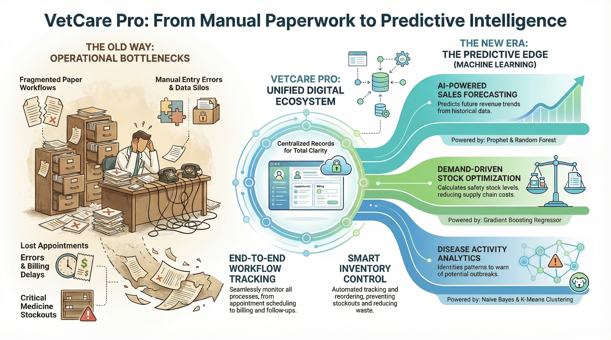

# VetCare Pro: Smart Web-Based Veterinary Clinic Management System




A full-stack veterinary clinic management system that handles everything from appointment scheduling and electronic medical records to AI-powered sales forecasting, disease outbreak analytics, and inventory demand forecasting.

---

## Tech Stack

- **Frontend:** React 19, Vite, React Router, Recharts, Axios
- **Backend:** Node.js, Express 5, PostgreSQL, JWT Auth, Multer
- **ML Service:** Python, Flask, scikit-learn, Prophet, Pandas

---

## Running Locally

### Prerequisites

- Node.js v18+
- PostgreSQL v14+
- Python 3.10+

### 1. Database

```bash
psql -U postgres -c "CREATE DATABASE vetcarepro;"
psql -U postgres -d vetcarepro -f database/schema.sql
psql -U postgres -d vetcarepro -f database/seed.sql
```

### 2. Backend

```bash
cd server
npm install
cp .env.example .env
```

Edit `.env` and fill in your values:

```
PORT=3000
DB_HOST=localhost
DB_PORT=5432
DB_NAME=vetcarepro
DB_USER=postgres
DB_PASSWORD=your_db_password
JWT_SECRET=any_random_secret_string
ML_SERVICE_URL=http://localhost:5001
SMTP_HOST=smtp.gmail.com
SMTP_USER=your_email@gmail.com
SMTP_PASS=your_app_password
```

```bash
npm run dev        # runs on http://localhost:3000
```

### 3. Frontend

```bash
cd client
npm install
npm run dev        # runs on http://localhost:5173
```

### 4. ML Service

```bash
cd ml
python3 -m venv venv
source venv/bin/activate      # Windows: venv\Scripts\activate
pip install -r requirements.txt
cp .env.example .env
```

Edit `.env` and fill in your database credentials, then:

```bash
python app.py      # runs on http://localhost:5001
```

---

## Default Login Credentials (Seed Data)

| Role          | Email                  | Password      |
|---------------|------------------------|---------------|
| Admin         | admin1@propet.lk       | admin1@pass   |
| Veterinarian  | dulani@propet.lk       | password123   |
| Receptionist  | kumari@propet.lk       | password123   |

> These credentials are only available after running the seed file.

---

## Notes

- The ML service is optional - the core app works without it, but analytics features will be unavailable.
- Email features require a valid SMTP configuration (e.g. a Gmail app password).
- Uploaded files (pet images, lab reports) are stored in `server/uploads/` and are not included in this repository.

---

## License

This project is proprietary software. See the [LICENSE](LICENSE) file for full terms.

All rights are reserved by the author. You may clone and run this project on your local machine for viewing and testing purposes only.

**Any other use — including deployment, modification, distribution, or commercial use — requires explicit written permission from the author.**

&copy; 2025 Kalhara Tennakoon. All Rights Reserved.
