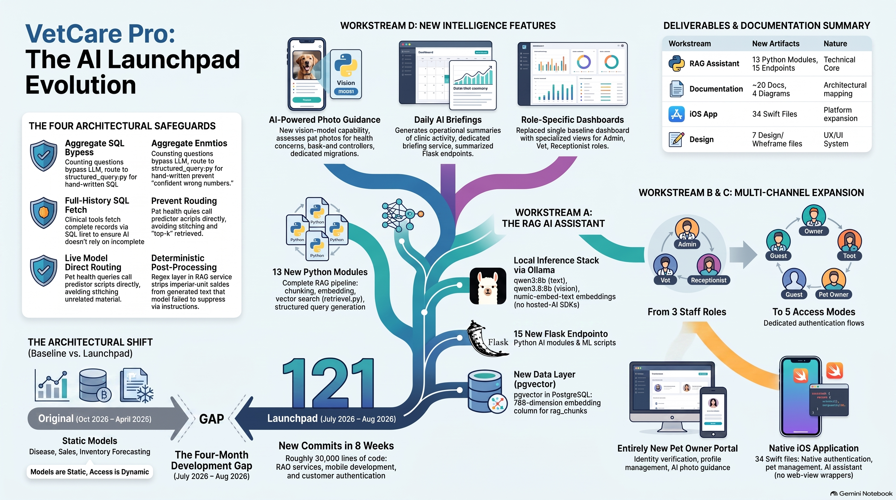

# VetCare Pro: Smart Web-Based Veterinary Clinic Management System



*Overview generated using [NotebookLM](https://notebooklm.google.com) — for illustrative purposes only.*

A full-stack veterinary clinic management system that handles everything from appointment scheduling and electronic medical records to AI-powered sales forecasting, disease outbreak analytics, and inventory demand forecasting.

---

## Tech Stack

- **Frontend:** React 19, Vite, React Router, Recharts, Axios
- **Backend:** Node.js, Express 5, PostgreSQL, JWT Auth, Multer
- **ML Service:** Python, Flask, scikit-learn, Prophet, Pandas
- **AI Assistant:** Retrieval-Augmented Generation (RAG) over [Ollama](https://ollama.com), running fully local/free (no external API keys or per-token cost)

---

## AI Assistant (RAG)

VetCare Pro includes an AI assistant/copilot built with Retrieval-Augmented Generation, grounded in the clinic's own data rather than the model's general training - positioned strictly as a **decision-support tool, never a replacement for professional veterinary judgment**.

**Models (via [Ollama](https://ollama.com), running locally):**

| Purpose | Model | Notes |
|---|---|---|
| Embeddings | `nomic-embed-text` | 768-dim vectors, stored in Postgres via `pgvector` |
| Chat / generation | `qwen2.5:7b-instruct` | Configurable via the `OLLAMA_CHAT_MODEL` env var |

Install Ollama, then pull both models before starting the ML service:

```bash
ollama pull nomic-embed-text
ollama pull qwen2.5:7b-instruct
```

**What it does:**
- Answers questions grounded in pet records, FAQs, and care instructions, citing its sources
- Generates plain-language summaries (medical history, consultation notes, owner-friendly aftercare instructions)
- Translates existing ML outputs (disease outbreak risk, sales/inventory forecasts) into clear natural-language explanations
- For receptionists specifically: can also answer billing questions (balances, payment status, price estimates), and - after an explicit confirm step - book/reschedule/cancel appointments, send appointment reminders, and register new customers/pets conversationally

**Access is scoped by role**, so private clinic data stays protected:
- **Guest** (no login) - general pet-care info only, no clinic/account data
- **Pet owner** (logged in) - own pet/appointment/record data only
- **Clinic staff** (admin/veterinarian/receptionist) - full clinic data, scoped further per role (e.g. receptionists don't get clinical diagnosis detail)

Exact/aggregate questions ("how many appointments today?") are answered via deterministic SQL rather than semantic search, since RAG only ever sees a small sample of matching records and would otherwise risk a confidently-wrong guess at a count.

---

## Running Locally

### Prerequisites

- Node.js v18+
- PostgreSQL v14+
- Python 3.10+

### 1. Database

```bash
psql -U postgres -c "CREATE DATABASE vetcarepro;"
psql -U postgres -d vetcarepro -f database/schema.sql
psql -U postgres -d vetcarepro -f database/seed.sql
```

### 2. Backend

```bash
cd server
npm install
cp .env.example .env
```

Edit `.env` and fill in your values:

```
PORT=3000
DB_HOST=localhost
DB_PORT=5432
DB_NAME=vetcarepro
DB_USER=postgres
DB_PASSWORD=your_db_password
JWT_SECRET=any_random_secret_string
ML_SERVICE_URL=http://localhost:5001
SMTP_HOST=smtp.gmail.com
SMTP_USER=your_email@gmail.com
SMTP_PASS=your_app_password
```

```bash
npm run dev        # runs on http://localhost:3000
```

### 3. Frontend

```bash
cd client
npm install
npm run dev        # runs on http://localhost:5173
```

### 4. ML Service

```bash
cd ml
python3 -m venv venv
source venv/bin/activate      # Windows: venv\Scripts\activate
pip install -r requirements.txt
cp .env.example .env
```

Edit `.env` and fill in your database credentials, then:

```bash
python app.py      # runs on http://localhost:5001
```

---

## Default Login Credentials (Seed Data)

| Role          | Email                  | Password      |
|---------------|------------------------|---------------|
| Admin         | admin1@propet.lk       | admin1@pass   |
| Veterinarian  | dulani@propet.lk       | password123   |
| Receptionist  | kumari@propet.lk       | password123   |
| Pet Owner     | kalharatennakoonmck@gmail.com| customer@pass |
| Pet Owner     | kavindra.d@gmail.com   | customer@pass |

    
> These credentials are only available after running the seed file.

Every other pet owner account — whether seeded or created later by staff — starts with no usable password; there is no shared default. To set one, the owner selects **"Set Up Your Account"** on the pet owner login page and confirms the email and phone number the clinic has on file (`POST /api/customer-auth/verify-identity`), then chooses a password (`/set-password`). Both routes live in `server/src/routes/customerAuthRoutes.js`.

---

## Notes

- The ML service is optional - the core app works without it, but analytics features will be unavailable.
- The AI assistant requires Ollama running locally with both models pulled (see [AI Assistant (RAG)](#ai-assistant-rag) above) - without it, chat requests will return a "currently unavailable" message instead of failing the app.
- Email features require a valid SMTP configuration (e.g. a Gmail app password).
- Uploaded files (pet images, lab reports) are stored in `server/uploads/` and are not included in this repository.

---

## License

This project is proprietary software. See the [LICENSE](LICENSE) file for full terms.

All rights are reserved by the author. You may clone and run this project on your local machine for viewing and testing purposes only.

**Any other use — including deployment, modification, distribution, or commercial use — requires explicit written permission from the author.**

&copy; 2026 Kalhara Tennakoon. All Rights Reserved.
