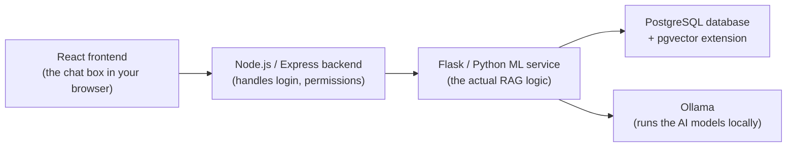

# How the AI Assistant (RAG) Works

This document explains, in simple terms, how VetCare Pro's AI assistant works under the hood. It's written for someone with basic CS/programming knowledge (e.g. a 2nd-year CS student) who hasn't necessarily studied AI or machine learning yet.

---

## 1. The problem: AI models make things up

Large Language Models (LLMs) — the kind of AI that ChatGPT and similar tools use — are very good at writing natural-sounding sentences. But they don't actually "know" your clinic's data. If you just asked a plain LLM:

> "What vaccines has Max had?"

...it has never seen your database. It has two choices: refuse to answer, or **guess** something that sounds plausible. That guessing is called **hallucination** — the model confidently states something false, because it was trained to produce fluent text, not to check facts.

For a vet clinic app, a hallucinated medical answer is dangerous. So we don't let the AI model answer from memory. Instead we use an approach called **RAG**.

---

## 2. RAG in one sentence

**RAG = Retrieval-Augmented Generation.** Before the AI writes an answer, we first *retrieve* (look up) real data related to the question, and then ask the AI to *generate* an answer using **only** that real data — like an open-book exam instead of a memory quiz.

Two steps, in order:
1. **Retrieval** — search the real database for information relevant to the question.
2. **Generation** — hand that information to the AI model and say "using only this, answer the question in plain English."

---

## 3. The big picture (architecture)

VetCare Pro is split into a few pieces that talk to each other:

- **React frontend** — the chat window you type into (e.g. `client/src/pages/AIAssistant.jsx`).
- **Node/Express backend** — checks who you are (logged in as a guest, pet owner, or staff member) and forwards your question to the Python service. It never trusts the frontend to say "I'm an admin" — it checks your login session itself.
- **Flask/Python ML service** — this is where the actual RAG logic lives (`ml/app.py` and everything in `ml/scripts/rag/`).
- **PostgreSQL + pgvector** — the same database the rest of the app uses, with an extra feature (`pgvector`) that lets it store and search lists of numbers efficiently (explained in the next section).
- **Ollama** — a free, open-source tool that runs AI models **on your own computer**, instead of sending your data to an external company's API over the internet. This means no per-question cost and no clinic data leaving the server.

**The two models used (via Ollama):**

| Model | Job | Notes |
|---|---|---|
| `nomic-embed-text` | Turns text into a list of numbers (an "embedding") | Used for search/retrieval |
| `qwen2.5-coder:7b` | Writes the final natural-language answer | Used for generation |

---

## 4. What is an "embedding"? (the key idea behind retrieval)

Imagine you could turn every sentence into a single point on a map, where sentences with **similar meaning** end up **close together** on that map, and sentences with different meanings end up far apart.

That "point on a map" is called an **embedding** (also called a **vector**) — it's just a long list of numbers (768 numbers, in our case) that represents the *meaning* of a piece of text.

Example (numbers made up, just to illustrate the idea):
- "What vaccines has Max had?" → `[0.12, -0.45, 0.88, ...]`
- "Max's vaccination history" → `[0.14, -0.42, 0.85, ...]` (very close to the first one — similar meaning!)
- "How much does a checkup cost?" → `[0.91, 0.03, -0.20, ...]` (far away — different meaning)

`pgvector` is a Postgres extension that can store millions of these number-lists and quickly answer: *"which stored pieces of text have embeddings closest to this new embedding?"* This distance-checking is called **cosine similarity** — you don't need the maths, just know it means "how similar are these two points."

So when the clinic's medical records, FAQs, and care instructions were loaded into the system, each piece of text was also converted into an embedding and stored alongside it. This happens in `ml/scripts/rag/ingest.py` and `ml/scripts/rag/chunking.py`, and the stored pieces are called **chunks** (small, bite-sized pieces of text, not entire documents).

---

## 5. Step-by-step: what happens when you ask a question

Let's trace exactly what happens when a receptionist types: *"What vaccines has Max had?"*

1. **You type the question** into the chat box in the browser.
2. **The frontend sends it to Node**, along with nothing about *who* you are — Node already knows that from your login session (a JWT token), so it can't be faked by editing the request.
3. **Node forwards the question to Flask**, now including your role (e.g. `"receptionist"`) and, if you're a pet owner, your customer ID — decided server-side, never trusted from the browser.
4. **Flask first checks: "is this an exact count/list question?"** (`structured_query.py`). Things like *"how many appointments today?"* or *"what vaccines has Max had?"* are answered with a normal, exact SQL query — **no AI model involved at all** for this step. Why? Because in step 5 below, the AI model only ever sees a *small handful* of matching chunks, never the whole database — so if you ask it to *count* something, it would have to guess, and guessing a count is exactly the kind of hallucination we're trying to avoid. Regex (pattern matching on the question text) decides whether a question matches one of these "exact answer" patterns.
5. **If it's not an exact-query question, the actual RAG steps run**:
   - a. Turn your question into an embedding (ask Ollama's `nomic-embed-text` model for the numbers).
   - b. Ask Postgres (via `pgvector`) for the stored chunks whose embeddings are closest to your question's embedding — this is `ml/scripts/rag/retrieval.py`. This search is also **filtered by your role**, so a pet owner's question can never retrieve another customer's data, and a guest's question can never retrieve real clinic records at all — only public FAQs.
   - c. This returns a small number of the most relevant chunks (e.g. the top 5) — not everything in the database, just the best matches.
6. **Flask builds a prompt** — a written instruction for the AI model, roughly:
   > "Here is some real information: [the retrieved chunks]. Using ONLY this information, answer this question: [your question]. Don't make anything up."

   Different **system prompts** (instruction sets) are used depending on your role — pet owners get warm, simple, jargon-free explanations; staff get more clinical language; guests get general pet-care advice when there's no exact clinic FAQ match. This logic lives in `ml/scripts/rag/rag_service.py`.
7. **The prompt is sent to Ollama**, which runs the `qwen2.5-coder:7b` model **on the server itself** — nothing is sent to an outside AI company.
8. **The AI's answer, plus a list of "sources"** (which real records were used) travel back: Ollama → Flask → Node → your browser. That's why the chat window shows little source tags under each answer — so you can verify exactly which record the answer came from, instead of just trusting it blindly.

---

## 6. Keeping data private: the three access modes

The same AI assistant behaves differently depending on who's asking, so private clinic data never leaks to the wrong person:

| Mode | Who | Can see |
|---|---|---|
| **Guest** | Anyone, no login | General pet-care tips and public FAQs only — no real clinic or customer data |
| **Pet owner** | Logged-in customer | Only their **own** pets' records, appointments, and bills |
| **Staff** | Admin / veterinarian / receptionist (logged in) | Full clinic data — but even between staff roles, some things are extra-restricted (e.g. receptionists can look up vaccination history, but can't see medical diagnoses — that's kept for vets/admins only) |

This scoping is enforced on the **server side** every time (in `retrieval.py`'s SQL queries and `structured_query.py`'s role checks) — it's not just "hidden" in the interface, it's genuinely impossible to retrieve through the API.

---

## 7. Beyond answering questions: taking actions (for receptionists)

Recently, the assistant was extended so receptionists can also ask it to **do things**, not just answer questions — like booking an appointment. This is handled carefully so the AI never silently changes real data:

1. **Spotting the request** — simple pattern matching (not the AI model) checks if your message looks like "book an appointment", "cancel", "send a reminder", "register a new customer", etc. (`ml/scripts/rag/action_intent.py`).
2. **Pulling out the details** — the AI model is asked to extract structured details from your sentence (which pet, what date, what time) into a small JSON object — like filling in a form. The AI is only ever used to *read* your sentence and organize it, never to decide what to write to the database.
3. **Asking for anything missing** — if you didn't mention a time, the assistant just asks you, like a normal conversation, until every required detail is filled in.
4. **Always confirming first** — once everything is filled in, the assistant shows a **Confirm / Cancel** button. Nothing is booked, cancelled, or emailed until you explicitly click **Confirm**.
5. **The actual database change** only happens after confirmation, on the Node.js server, using the exact same safety checks the manual "New Appointment" form already uses (e.g. making sure a vet isn't double-booked at the same time).

This keeps a clear line: the AI can **suggest** an action and **read** clinic data, but a human always makes the final call before anything is written.

---

## 8. Why not just let the AI answer everything directly?

Two reasons, both already explained above, worth repeating together:

- **Hallucination** — an AI model answering purely "from memory" (no retrieval) will confidently invent facts it was never given. RAG fixes this by only allowing it to use real, retrieved data.
- **Counting is unreliable with retrieval alone** — even *with* retrieval, the model only ever sees a handful of matching chunks (say, the top 5), never the full table. So for questions like *"how many appointments are there today?"*, letting the AI "count what it sees" would still be a guess. That's why exact SQL is used instead, whenever the question is a count/list rather than an open-ended one.

---

## 9. Key files, if you want to explore the code

| File | What it does |
|---|---|
| `ml/app.py` | The Flask web server — defines the `/api/ml/rag/chat` endpoint the Node backend calls |
| `ml/scripts/rag/rag_service.py` | The main "traffic controller" — decides: action? exact SQL? or full RAG? |
| `ml/scripts/rag/structured_query.py` | Answers exact count/list questions with real SQL, no AI involved |
| `ml/scripts/rag/action_intent.py` | Detects and carries out write-actions (booking, reminders, intake) after confirmation |
| `ml/scripts/rag/retrieval.py` | Does the actual "find similar chunks" search using `pgvector` |
| `ml/scripts/rag/ingest.py` / `chunking.py` | Turns clinic data (FAQs, records) into stored, embedded chunks |
| `ml/scripts/rag/ollama_client.py` | The code that actually talks to Ollama (both models) |
| `server/src/controllers/aiController.js` | Node's entry point — checks who you are, forwards to Flask |
| `server/src/services/aiService.js` | Node's HTTP client that calls the Flask service |
| `client/src/pages/AIAssistant.jsx` | The staff chat page in the browser |

---

## 10. Quick glossary

- **LLM (Large Language Model)** — an AI model trained on huge amounts of text, good at producing natural-sounding language.
- **RAG (Retrieval-Augmented Generation)** — look up real data first, then let the AI write an answer using only that data.
- **Embedding / vector** — a list of numbers representing the *meaning* of a piece of text, so similar meanings end up as nearby numbers.
- **pgvector** — a Postgres extension that stores embeddings and quickly finds the closest ones.
- **Cosine similarity** — the maths used to measure "how close" two embeddings are (you just need to know: bigger similarity = more related meaning).
- **Chunk** — a small piece of text (e.g. one FAQ answer, one medical record) stored with its embedding, ready to be retrieved.
- **Hallucination** — when an AI model confidently states something false because it's guessing rather than using real data.
- **Prompt** — the written instructions given to the AI model before it generates an answer.
- **Ollama** — free, open-source software that runs AI models on your own computer instead of calling an external paid API.
